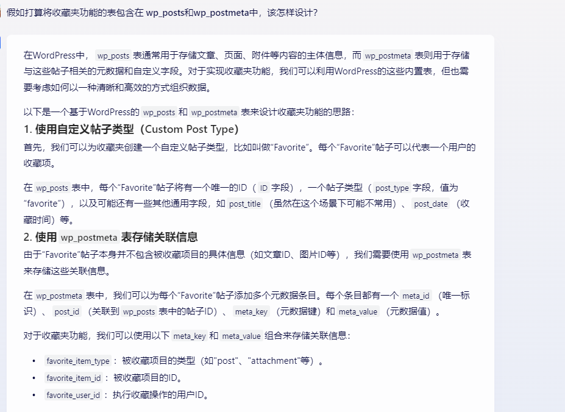
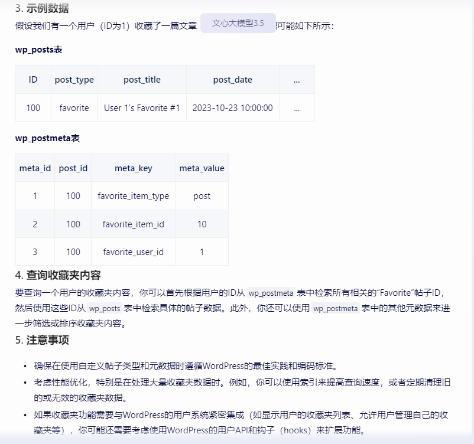
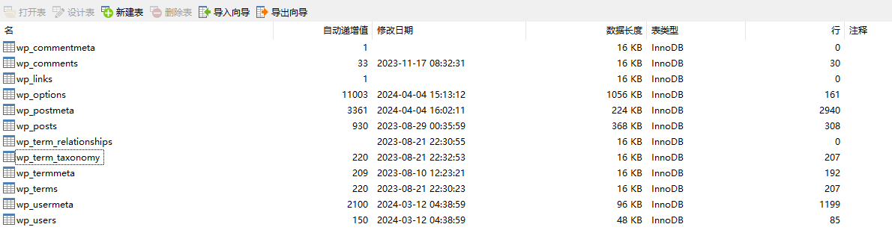

# 数据库结构设计

## 核心结构

### 用户

#### zt_user

```sh
ID：用户ID
user_login：用户登录名
user_pass：用户密码
user_nicename：用户昵称
user_email：用户邮箱
user_url：用户个人网站
user_registered：用户注册时间
user_activation_key：用户激活码
// 用户邀请码
user_status：用户状态
display_name：用户显示名称
// spam：是否为垃圾评论
```

#### zt_usermeta

####

### 内容

#### 主要类型

- 博客
- 文章
- 文库
- 期刊
- 问答
- 方案
- 网址
- 人物
- 特殊：收藏夹





#### zt_content

- 类型
- 标题
- 发布时间
- 作者
- 状态

#### zt_contentmeta

### 评论

### 分类

### 标签

## 项目参考

### wordpress



#### 文章评论

wp_commentmeta

wp_comments

#### 链接信息

wp_links

功能：用于存储友情链接（Blogroll）信息，这是旧版本 WordPress 或某些链接管理插件使用的功能。

#### 文章信息

wp_options

功能：用于存储 WordPress 系统的各种设置和选项，如站点 URL、管理员电子邮件地址、时区设置等。此外，还用于存储插件和主题的配置信息。

wp_postmeta

wp_posts

功能：用于存储所有的文章、页面、自定义帖子类型的数据。这包括帖子的内容、标题、发布时间、作者、状态等。

#### 分类信息

wp_terms

功能：用于存储分类目录、标签、自定义分类法的术语。这些术语用于组织和管理网站的内容。

wp_term_relationships

功能：用于存储每个文章、页面或其他内容与特定分类或标签之间的关系。这有助于确定哪些内容属于哪个分类或标签。

wp_term_taxonomy

功能：用于存储每个分类或标签的分类法（taxonomy）信息。分类法是一种将术语（如标签和分类）组织成层次结构或平面的方式。

wp_termmeta

#### 用户信息

wp_usermeta：用户自定义字段表

```sh
umeta_id：用户自定义字段ID
user_id：用户ID
meta_key：用户自定义字段名称
meta_value：用户自定义字段值
```

常用键值对

```sh
nickname：用户昵称
first_name：用户名
last_name：用户姓
description：用户描述
rich_editing：是否启用富文本编辑器
comment_shortcuts：是否启用评论快捷键
admin_color：后台管理界面颜色
use_ssl：是否启用SSL
show_admin_bar_front：是否在前台显示管理栏
locale：用户语言设置
wp_user_level：用户等级
dismissed_wp_pointers：已关闭的提示信息
show_welcome_panel：是否显示欢迎面板
session_tokens：会话令牌
session_expiration：会话过期时间
session_expiration_dategmt：会话过期时间（GMT）
wp_capabilities：用户权限
wp_user_settings：用户设置
wp_user-settings-time：用户设置时间
wp_dashboard_quick_press_last_post_id：上次发布文章ID
```

wp_users：用户基本信息表

功能：用于存储用户的基本信息，包括用户名、密码（通常经过哈希处理）、电子邮件、用户角色等。

字段示例：ID、user_login、user_pass、user_email、user_role 等。

```sh
ID：用户ID
user_login：用户登录名
user_pass：用户密码
user_nicename：用户昵称
user_email：用户邮箱
user_url：用户个人网站
user_registered：用户注册时间
user_activation_key：用户激活码
// 用户邀请码
user_status：用户状态
display_name：用户显示名称
// spam：是否为垃圾评论
```
