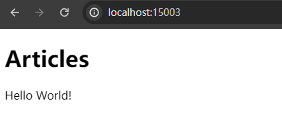

# 环境准备

## 初始化

```bash
mkdir ZhenPath

cd ZhenPath

git init
```

node & npm 版本

```bash
PS D:\project\zhenpath\admin> node -v
v20.5.1
PS D:\project\zhenpath\admin> pnpm -v
9.1.3

```

## 后端系统

### 初始化

```bash

PS D:\project\ZhenPath> nest new backend
⚡  We will scaffold your app in a few seconds..

? Which package manager would you ❤️  to use? pnpm


cd backend

npm run start:dev

```

访问：http://localhost:3000/

### 修改端口

```ts
// src/main.ts
import { NestFactory } from '@nestjs/core';
import { AppModule } from './app.module';

async function bootstrap() {
  const app = await NestFactory.create(AppModule);
  await app.listen(13001);  // 修改端口为 13001
}
bootstrap();

```

## 前台系统

```bash
pnpm dlx nuxi@latest init frontend
```

### 修改端口

```ta
// https://nuxt.com/docs/api/configuration/nuxt-config
export default defineNuxtConfig({
  devtools: { enabled: true },
  devServer: {
    port: 15003,
  },
})

```

## 后台系统

下载安装包：<https://github.com/vbenjs/vue-vben-admin/tree/v2.11.4>

改名：admin
```bash
cd admin 

pnpm i

npm run dev
```

打开网址：http://localhost:5173/

## 前后端测试

```vue
// nuxt - app.vue
<template>
  <div>
    <h1>Articles</h1>
      {{ article }}
  </div>
</template>

<script setup>
import { ref, onMounted } from 'vue';
import axios from 'axios'; // 确保你已经安装了 axios

// 声明响应式数据
const article = ref([]);

// 生命周期钩子
onMounted(async () => {
  try {
    const response = await axios.get('http://127.0.0.1:13001/ping'); // 假设你的后端 API 路径是 /api/articles
    article.value = response.data; // 假设后端返回的是一个文章数组
  } catch (error) {
    console.error('Error fetching articles:', error);
  }
});

</script>
```

