# 双系统配置

## 简要说明

1）设置 BIOS，确保断电后，来电就启动本系统。

2）安装 win10 企业版，激活，尽可能升级最新。通常用 2~4TB 机械盘直接安装，不用 NVMe 盘，也不用 SSD 盘。分出 100GB 用作 D 盘备份常用安装软件，其余都用作系统盘。

3）安装 linux 子系统，win10 会默认安装在 C 盘里。再安装 OpenJDK1.8，安装 MySQL5.7。

4）在 windows 下添加启动脚本，确保开机启动 linux 下的相关程序。

5）linux 子系统中安装监测采集，和监测查看的系统。

## 计算机系统

### WSL 配置

在程序与功能中勾选并开放 wsl 的权限，并重启电脑进行加载 wsl 的配置文件


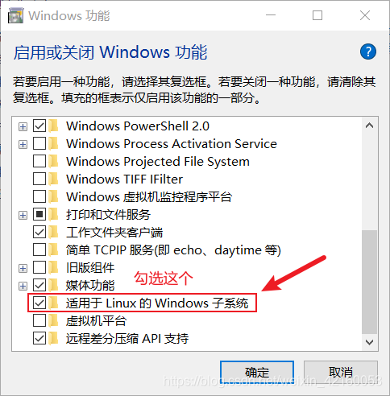

::: info 常用命令

- 查看运行的子系统

```bash
wsl --list --verbose
```

- 在 WSL 中检查 /etc/rc.local 文件是否存在：

```bash
wsl -d Ubuntu-18.04 -u root ls /etc/rc.local
```

:::

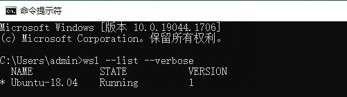

### ubuntu 安装

（1）打开 Microsoft Store 应用商店下载 Ubantu18.04

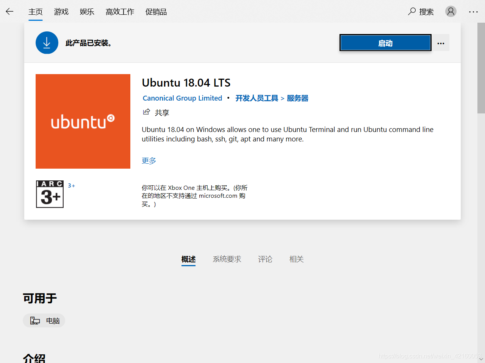

（2）直接安装并配置对应的用户账号和密码

::: info 默认配置
普通账号：

- tonglei
- h_9

管理员：

- root
- T_s
  :::

::: warning 报错处理
问题 1 WslRegisterDistribution failed with Error: 0x8007019e

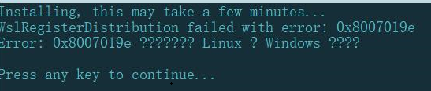

原因：Windows 功能中未启用【适用于 Linux 的 Windows 子系统】
:::

（3）查看 windos 及 ubuntu 的 IP 地址
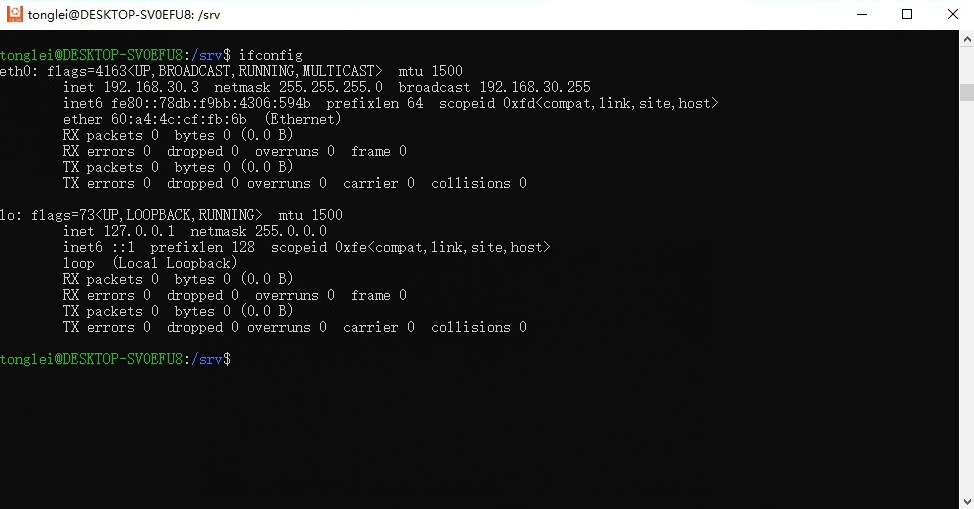

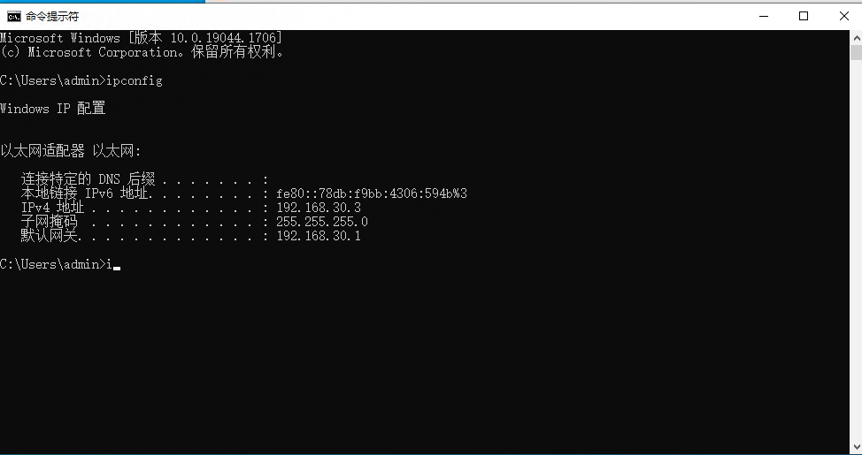

### 读取系统盘

```bash
// c d 盘
ls /mnt/
```


## 远程连接

### 免密登录

（1）切换使用 root 用户

```
su
>>输入root密码
```

（2）如果没有为 root 创建密码则先设置

```
sudo passwd root
```

（3）生成密钥

```
ssh-keygen
```

（4）将生成的公钥拷贝到要映射的主机

```
ssh-copy-id -i ~/.ssh/id_rsa.pub ubuntu@123.206.175.241
ssh-copy-id ubuntu@123.206.175.241
```

（5）测试免密登陆

```
ssh ubuntu@123.206.175.241
```

### ssh 远程

::: warning 注意
Ubuntu 子系统自带的 ssh 服务无法连接，需卸载后重新安装。
:::

（1）卸载重装 openssh-server

```bash
sudo apt-get remove openssh-server

sudo apt-get install openssh-server
```

（2）编辑/etc/ssh/sshd_config 文件

```bash
vim /etc/ssh/sshd_config
```

```bash
// 修改下述信息

Port 2222 # 修改端口号，避免和 Windows ssh 服务端口冲突
UsePrivilegeSeparation yes # 使用密码登录
PermitRootLogin yes # 允许使用 root 用户登录

```

（3）重启 ssh 服务

```bash
sudo service ssh restart
```

（4）查看 ssh 服务是否启动

```bash
sudo service ssh status
```

（5）xshell 本机连接测试

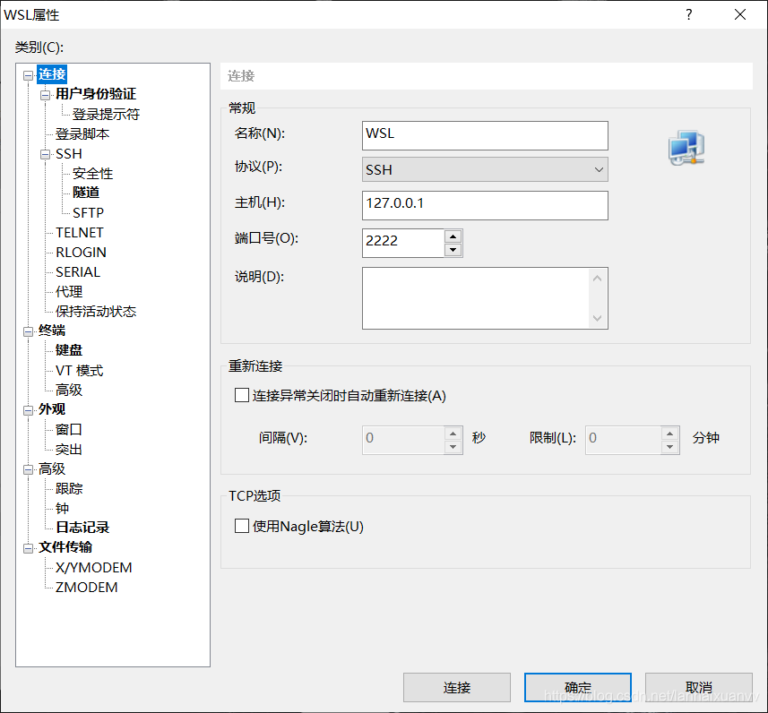

（6）xshell 局域网连接测试

### 反向代理

（1）安装 autossh

```bash
sudo apt-get install autossh
```

（2）配置信息

```bash
autossh -M 45050 -fCNR '*:40050:127.0.0.1:2222' ubuntu@123.206.175.241 -o ServerAliveInterval=60 &
```

（3）查看是否开启
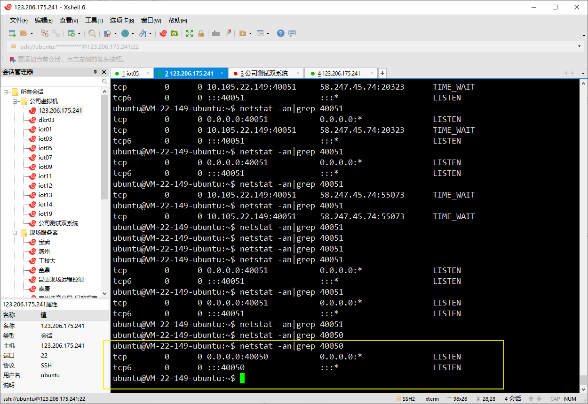

（4）建立连接

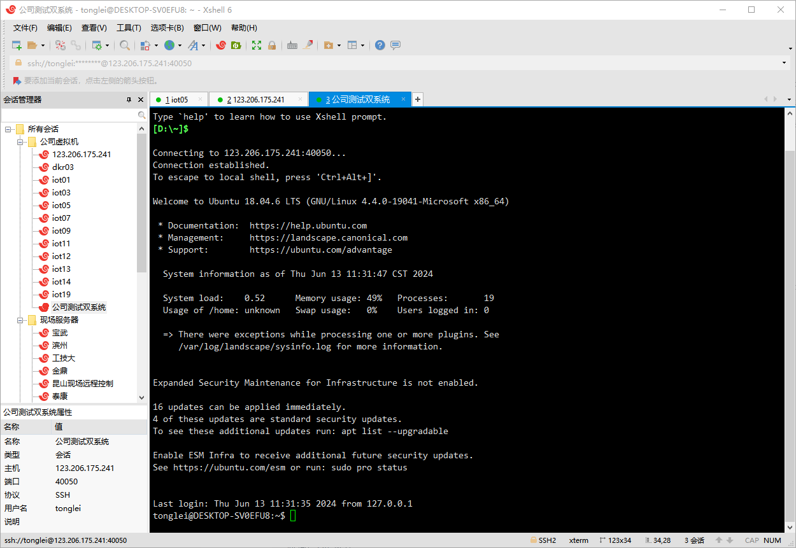

### 系统自启

（1）在 windows 下添加启动脚本，确保开机启动 linux 下的相关程序。

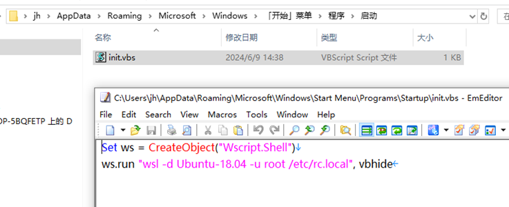

::: info 命令解析

- 创建一个 WScript.Shell 对象并将其赋值给变量 ws。这个对象可以用于执行命令和操作系统操作。
- 使用 WScript.Shell 对象的 Run 方法来运行命令 "wsl -d Ubuntu-18.04 -u root /etc/rc.local"。
- vbhide 是一个常量，用于指定隐藏命令窗口。

:::

```bash
Set ws= CreateObject("Wscript.Shell")
ws.run "wsl -d Ubuntu-18.04 -u root /etc/rc.local", vbhide
```

（2）ubuntu 配置自启文件

```bash
vim /etc/rc.local
```

（3）添加以下内容

```bash
#!/bin/sh

#启动 ssh 服务
/etc/init.d/ssh start

#启动反向代理
autossh -M 45050 -fCNR '*:40050:127.0.0.1:2222' ubuntu@123.206.175.241 -o ServerAliveInterval=60 &
```

::: warning 问题排查：未能启动子系统的 rc.local 文件

1. 文件路径问题
   首先，确保 /etc/rc.local 文件存在并且具有可执行权限。在 Ubuntu 中，默认情况下这个文件可能不存在或者没有可执行权限。

2. WSL 命令格式问题
   在使用 Wscript.Shell 运行 WSL 命令时，确保命令格式正确。

3. 权限问题
   确保你以管理员身份运行脚本，因为某些操作可能需要提升权限。

检查和创建 /etc/rc.local
首先，在 WSL 中检查 /etc/rc.local 文件是否存在：

```bash
wsl -d Ubuntu-18.04 -u root ls /etc/rc.local

```

如果文件不存在，可以创建它，并赋予执行权限：

```bash
wsl -d Ubuntu-18.04 -u root touch /etc/rc.local
wsl -d Ubuntu-18.04 -u root chmod +x /etc/rc.local
```

:::

## 环境搭建

### Java

(1) 查找合适的 openjdk 版本

```sh
apt-cache search openjdk
```

（2）安装

```sh
sudo apt-get install openjdk-8-jdk
```

(3) 配置环境变量

```sh
vim ~/.bashrc
```

如何编辑？【i:进入编辑模式 esc:退出编辑 :wq 保存】

在最后一行加上:

```sh
export JAVA_HOME=/usr/lib/jvm/java-8-openjdk-amd64
export PATH=$JAVA_HOME/bin:$PATH
export CLASSPATH=.:$JAVA_HOME/lib/dt.jar:$JAVA_HOME/lib/tools.jar
```

(4) 执行 java -version 查看 java 版本

### Mysql

(1) 安装

```sh
# 安装mysql服务
sudo apt-get install mysql-server
# 安装客户端
sudo apt install mysql-client
# 安装依赖
sudo apt install libmysqlclient-dev
# 检查状态
sudo netstat -tap | grep mysql
```

(2) 查看已有账号

```sh
sudo cat /etc/mysql/debian.cnf
```

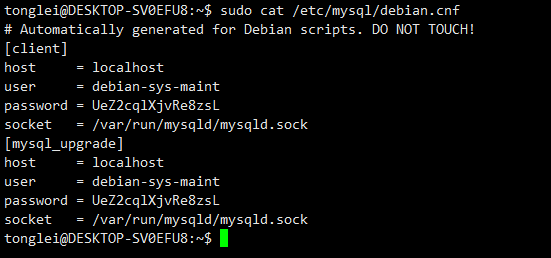

(3) 登录

```sh
mysql -udebian-sys-maint -pUeZ2cqlXjvRe8zsL
```

(4) 查看数据库

```sh
show databases;
```

(5) 使用 ‘mysql’这个库

```sh
use mysql;
update user set authentication_string=PASSWORD("自定义密码") where user='root';
update user set plugin="mysql_native_password";
flush privileges;
quit;
```

(6) 重启

```sh
/etc/init.d/mysql restart
```

## 项目应用

### 公司测试


