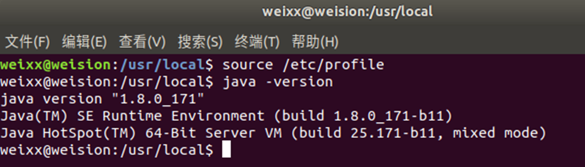
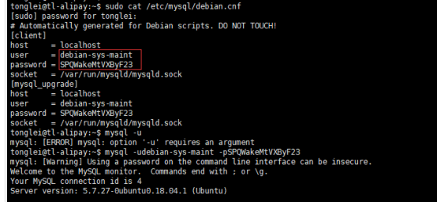

# 二、环境搭建

### 修改 ip

（1）首先查看目前 ip

```bash
ipconfig
```


（2）打开配置文件

::: warning 注意事项，netplan 为 ubuntu18+默认配置文件
检查是否安装

```bash
ubuntu@ubuntu:~$ which netplan
/usr/sbin/netplan
```

没有返回的话，需要自行安装

```bash
sudo apt-get install netplan.io
```

:::

```sh
sudo vi /etc/netplan/01-netcfg.yaml
```

（3）修改配置

(eth0:注意需要通过 ifconfig –a 确认)

```sh
# This file describes the network interfaces available on your system
# For more information, see netplan(5).
network:
  version: 2
  renderer: networkd
  ethernets:
    eth0:
      dhcp4: no
      addresses: [192.168.30.100/24]
      optional: true
      gateway4: 192.168.30.1
      nameservers:
              addresses: [192.168.30.1]
```

应用

```bash
sudo netplan apply
```

重启：

```sh
sudo reboot
```

查看是否成功

```bash
ubuntu@ubuntu:~$ ip addr show eth0
9: eth0: <BROADCAST,MULTICAST,UP,LOWER_UP> mtu 1500 qdisc pfifo_fast state UNKNOWN group default qlen 1000
    link/ether 00:c2:03:ba:dd:6e brd ff:ff:ff:ff:ff:ff
    inet 192.168.30.100/24 brd 192.168.30.255 scope global eth0
    inet6 fe80::e975:6b79:93ae:b137/64 scope link
       valid_lft forever preferred_lft forever
    inet6 fe80::2c2:3ff:feba:dd6e/64 scope link
       valid_lft forever preferred_lft forever

```

## 2.1 远程连接

### 2.1.1 安装 openssh

#### 包管理器安装

```sh
sudo apt-get install openssh
sudo apt-get install openssh-server
sudo apt-get install openssh-client
sudo systemctl start ssh-agent.service # 启动ssh服务

sudo systemctl status ssh # 检查OpenSSH服务器的状态，并确保它正在运行。
```

#### 手动安装

<https://cdn.openbsd.org/pub/OpenBSD/OpenSSH/portable/openssh-9.0p1.tar.gz>

tar -xzf openssh-9.0p1.tar.gz

### 2.1.2 免密登录

（1）切换使用 root 用户

```
su
>>输入root密码
```

（2）如果没有为 root 创建密码则先设置

```
sudo passwd root
```

（3）生成密钥

```
ssh-keygen
```

（4）将生成的公钥拷贝到要映射的主机

```
ssh-copy-id -i ~/.ssh/id_rsa.pub root@123.206.175.241
ssh-copy-id root@123.206.175.241
```

（5）测试免密登陆

```
ssh root@123.206.175.241
```

### 2.1.3 反向代理

#### 安装 autossh

(1) 下载 autossh 压缩包：

首先，你需要在官方网站或其他可信赖的资源中下载 autossh 的压缩包。你可以使用 wget 命令来下载，例如：

<https://www.harding.motd.ca/autossh/autossh-1.4e.tgz>

(2) 解压缩压缩包：

使用以下命令解压缩下载的压缩包：

```bash
tar -xzf autossh-1.4e.tgz
```

(3) 进入解压后的目录：

```bash
cd autossh-1.4e
```

(4) 编译和安装 autossh：

在解压后的目录中，执行以下命令编译和安装 autossh：

```bash
./configure
make
sudo make install
```

(5) 验证安装：

安装完成后，你可以使用以下命令验证 autossh 是否已成功安装：

```bash
autossh -V
```


#### 配置教程

```bash
SSH反向代理

******** 代理机 ******** <这个已在云服务器123.206.175.241好做>
# vi /etc/ssh/shhd_config
...
GatewayPorts yes
...
# service sshd restart

******** 目标机 ******** <这个需要做>
# ssh-keygen     // 生成密钥对
# ssh-copy-id root@123.206.175.241     // 公钥发代理机
# autossh -M 50202 -fCNR '*:50222:127.0.0.1:22' root@123.206.175.241 // 可手动运行测试
# pkill -3 autossh // 测试后手动关闭反向代理

******** 目标机配置开机自动启动反向代理 ******** <这个需要做>
# vi /etc/rc.local     // 添加启动项到旧配置rc.local
<--------------------------
...
autossh -M 50202 -fCNR '*:50222:127.0.0.1:22' root@123.206.175.241
...
-------------------------->
# vi /etc/systemd/system/rc-local.service     // 旧配置rc.local在启动任务中启动
<--------------------------
...
[Install]
WantedBy=multi-user.target
Alias=rc-local.service
-------------------------->
# ln -s /lib/systemd/system/rc.local.service /etc/systemd/system/   // lnk任务到启动目录
# systemctl start rc-local.service          // 可手动运行该任务测试，关闭同上

******** SSH加通道 ******** <在putty客户机配置，用于测试WEB服务>
PuTTY 配置 => 连接 => SSH => 通道
<--------------------------
源端口 8080
目的地 127.0.0.1:8080
本地
自动
-------------------------->
其中"源端口"指运行putty客户端程序的PC端口
其中"目的地"指远端运行SSH反向代理的目标机IP地址及端口
后两项固定
```

#### 配置过程

```bash
sudo autossh -M 40001 -fCNR '*:40002:127.0.0.1:22' root@123.206.175.241
```

说明：第一个端口是 autossh 的监视端口 ，将本地（127.0.0.1）的 22 端口映射到远程（123.206.175.241）的 40002 端口

查看端口情况(123.206.175.241)：

```
# 查看所有端口
netstat -an

# 查看指定端口
netstat -anp | grep 40002
```

远程连接现场服务器：123.206.175.241:40002


如需关闭反向代理

```
pkill -3 autossh
```

参考链接：

<https://zhuanlan.zhihu.com/p/112227542>

<https://blog.csdn.net/BBQ__ZXB/article/details/112670401>

## 2.2 JAVA 环境

安装 jdk1.8

教程：<https://developer.aliyun.com/article/704959>

### 2.2.1 apt 安装

（1）更新 apt

```sh
sudo apt update
```

附：更换镜像源
<https://blog.csdn.net/qq_43445867/article/details/123707266>

(2) 查找合适的 openjdk 版本

```sh
apt-cache search openjdk
```

（3）安装

```sh
sudo apt-get install openjdk-8-jdk
```

(4) 配置环境变量

```sh
vim ~/.bashrc
```

如何编辑？【i:进入编辑模式 esc:退出编辑 :wq 保存】

在最后一行加上:

```sh
export JAVA_HOME=/usr/lib/jvm/java-8-openjdk-amd64
export PATH=$JAVA_HOME/bin:$PATH
export CLASSPATH=.:$JAVA_HOME/lib/dt.jar:$JAVA_HOME/lib/tools.jar
```

(5) 执行 java -version 查看 java 版本



### 2.2.2 压缩包安装

华为云镜像源：<https://repo.huaweicloud.com/java/jdk/>

(1) 下载：jdk-8u171-linux-x64.tar.gz

(2) 解压：

```sh
tar -zxvf jdk-8u171-linux-x64.tar.gz
```

(3) 移动

```sh
sudo mv jdk1.8.0_171 /usr/local/jdk1.8
```

(4) 配置环境变量

这里我们修改全局配置文件，作用于所有用户：vim /etc/profile 在最后一行添加：

```sh
export JAVA_HOME=/usr/local/jdk1.8
export JRE_HOME=${JAVA_HOME}/jre
export CLASSPATH=.:${JAVA_HOME}/lib:${JRE_HOME}/lib
export PATH=.:${JAVA_HOME}/bin:$PATH
```


(5) 使配置生效

```sh
source /etc/profile
```

(6) 检查是否安装成功：java -version


## 2.3 数据库

### 2.3.1 安装 mysql

(1) 安装

```sh
# 安装mysql服务
sudo apt-get install mysql-server
# 安装客户端
sudo apt install mysql-client
# 安装依赖
sudo apt install libmysqlclient-dev
# 检查状态
sudo netstat -tap | grep mysql
```

(2) 查看已有账号

```sh
sudo cat /etc/mysql/debian.cnf
```



(3) 登录

```sh
mysql -udebian-sys-maint -pSPQWakeMtVXByF23
```

(4) 查看数据库

```sh
show databases;
```

(5) 使用 ‘mysql’这个库

```sh
use mysql;
update user set authentication_string=PASSWORD("自定义密码") where user='root';
update user set plugin="mysql_native_password";
flush privileges;
quit;
```

(6) 重启

```sh
/etc/init.d/mysql restart
```

### 2.3.2 更改 mysql 数据目录

系统环境：Ubuntu 12.04（其他版本其实也类似），使用 apt-get install mysql-server。

默认情况下，mysql 的数据目录是/var/lib/mysql，因为如果你的数据库以后会越来越大，那么你就得考虑用一个空间足够大的分区来存放数据库文件，所以还是选择把它修改到其他位置，比如/usr/data/mysql_data。这个目录可以直接挂载一个大硬盘。

具体修改方式如下（为了方便起见，你可以先用 su 命令将系统当前用户转到 root，否则以下命令可能都需要加上 sudo 前缀）：

```sh

# 1 停止mysql服务
/etc/init.d/mysql stop

# 2 备份原来的数据目录
chown mysql:mysql /usr/data/mysql_data

# 修改存储路径
vim /etc/mysql/my.cnf
# 找到datadir=/var/lib/mysql
# 将它改为datadir=/usr/data/mysql_data

# 拷贝原来的数据文件
cp -a /var/lib/mysql/* /usr/data/mysql_data

# 启动mysql服务
vim /etc/apparmor.d/usr.sbin.mysqld

#我们会看到此文件中有2行：
 /var/lib/mysql/ r,
 /var/lib/mysql/** rwk,

# 以上是针对默认数据目录的权限配置，所以据此我们增加两行，指向新目录，设置同样的权限：
 /newdir/mysql/ r,
 /newdir/mysql/** rwk,

# 实测：（2023-10-28）ubuntu18.04.03 server下，添加以下内容，存储位置：/srv/SqlData/
 /srv/SqlData/ r,
 /srv/SqlData/** rwk,

/etc/init.d/apparmor restart

/etc/init.d/mysql start

```

OK，到此就已经成功转移了 mysql 数据目录。
