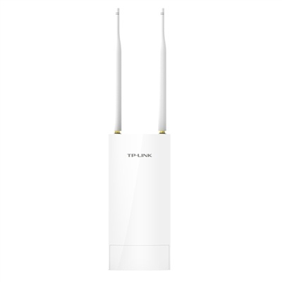
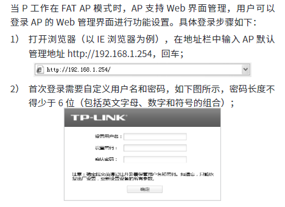
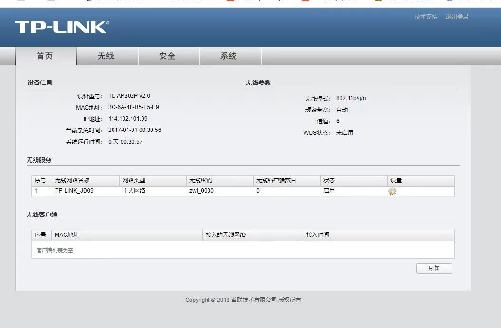
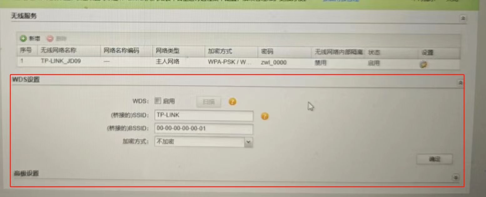
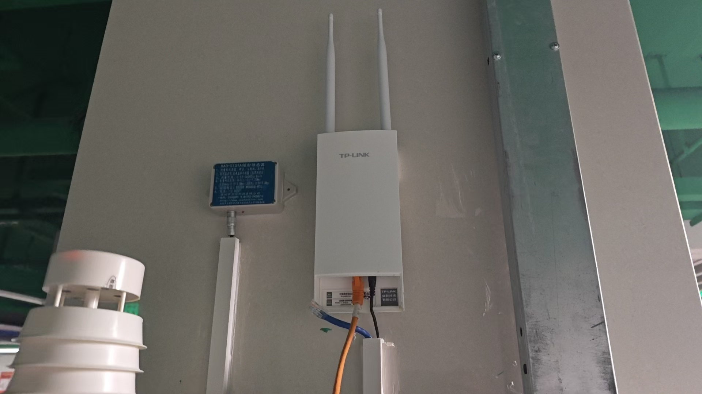

# 无线 AP TL-AP302P

官网介绍：<https://www.tp-link.com.cn/product_944.html?v=specification>

操作手册：<https://resource.tp-link.com.cn/pc/docCenter/showDoc?productId=944&type=SETUP_BOOK&id=1669629354773152>

## 参数配置

### 默认网址

### 金鼎参数

## 项目使用

金鼎天地

