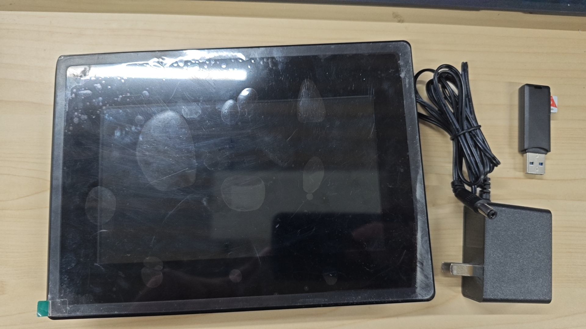
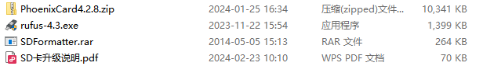
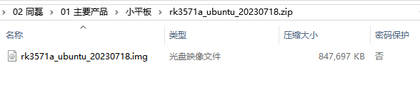
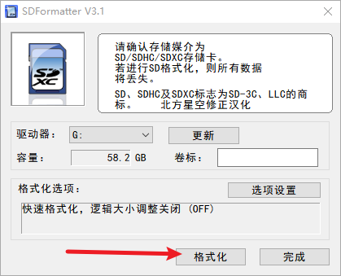
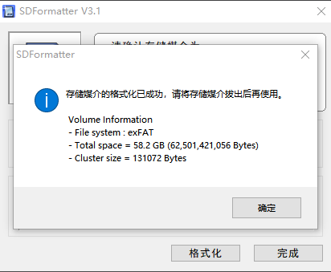
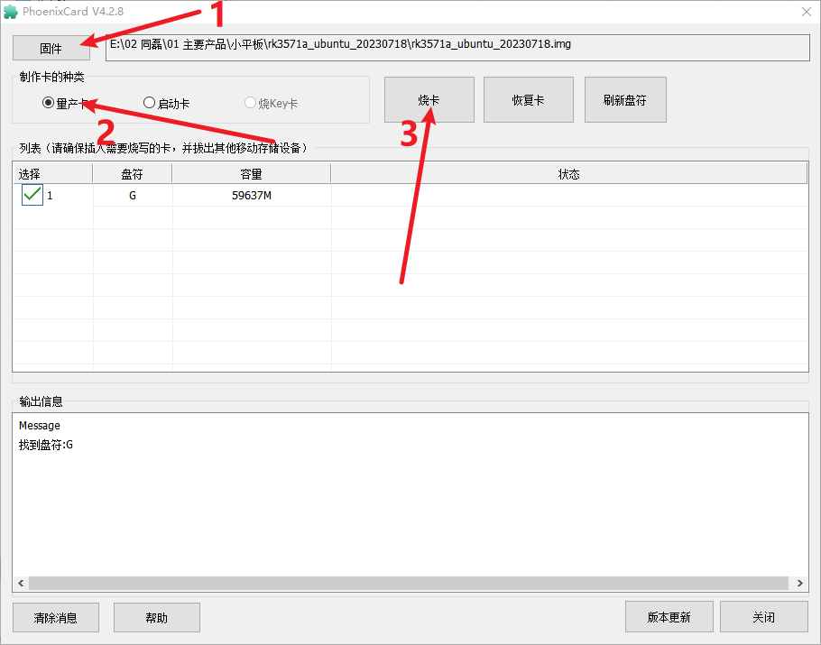
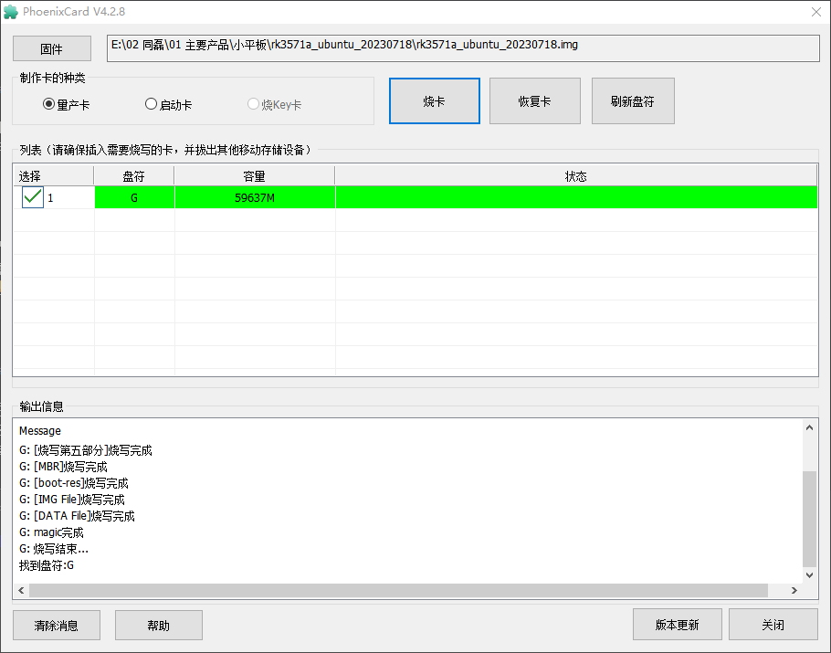
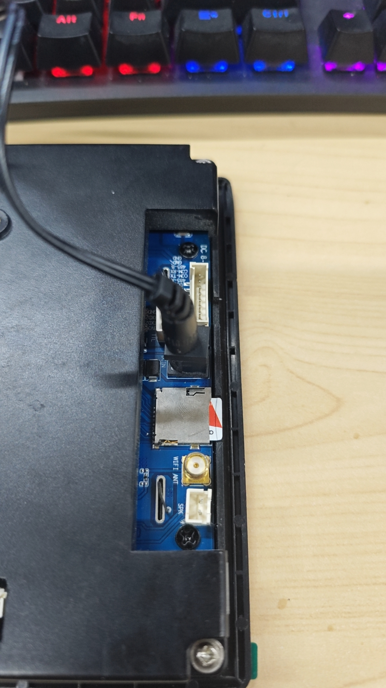
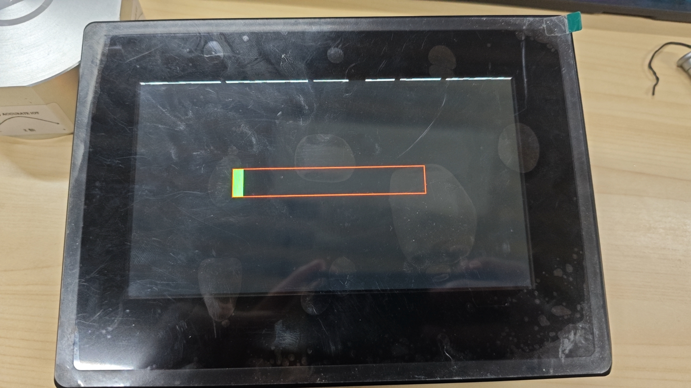

# 软方平板电脑


ubuntu18.04 ARM V7

## 网络设置

/etc/network/interfaces

```bash
# interfaces(5) file used by ifup(8) and ifdown(8)
# Include files from /etc/network/interfaces.d:

auto eth0
	iface eth0 inet static
		address 192.168.30.180
		gateway 192.168.30.1
		netmask 255.255.255.0

source-directory /etc/network/interfaces.d
```

## 启动配置

/etc/rc.local

```bash
#!/bin/bash

umount /d3820be6-cf3b-49f9-93dd-5817ee9c0ca9
mount /dev/mmcblk1p1 /srv
autossh -M 65411 -fCNR '*:65412:127.0.0.1:22' ubuntu@123.206.175.241 -o ServerAliveInterval=60
cd /srv/project
/srv/project/start
autossh -M 12009 -fCNR '127.0.0.1:12010:127.0.0.1:9003' baosteel@47.123.5.255 -o ServerAliveInterval=60
```

## 相关软件

### 软键盘：onboard

## 刷机

### 材料准备

硬件设备：


- 平板及电源适配器

- SD 卡及读卡器

配置软件：

- SDFormatter

- PhoenixCard

- Android 固件





### 制作升级卡

准备一张 SD 卡，拷贝出里面的重要数据，先用 SDFormatter 工具对 SD
卡进行格式化




然后打开 PhoenixCard 工具，选择格式化过得 SD 卡的盘符，
镜像文件选择需要烧录的 Android 固件文件，烧写模式选择“量产卡”，点
击“烧卡”按钮，等待烧录完成，升级 SD 卡就制 作完成了。





### 系统升级

将要升级的主板断电，插入制作好的升级 SD 卡，插入电源加电，板子上
的电源指示灯 会亮，升级开始，等到指示灯熄灭时，升级就完成了，此时
拔出升级 SD 卡（否则会重新升 级），再重新启动主板就可以了。





::: warning 注意
如果要将该升级 SD 卡作为普通 SD 卡在主板上使用，建议使用
SDFormatter 重新格式化，否则操作不当 会造成主板重新升级。
Ubuntu20.04 升级需使用 rufus-4.3.exe 工具来格式化 SD 卡。
:::
