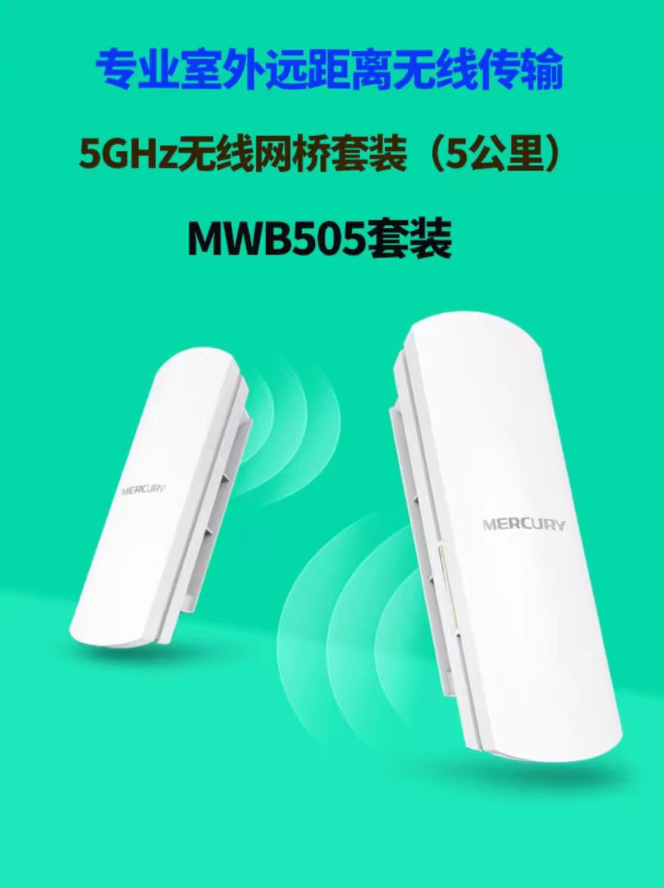
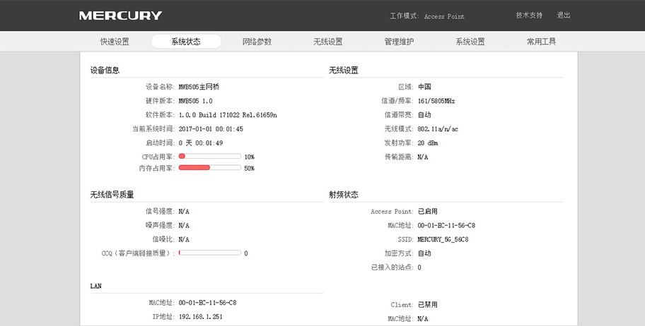

# MERCURY 无线网桥套装

官网介绍：<https://www.mercurycom.com.cn/product-260-1.html>

产品手册：<https://service.mercurycom.com.cn/content/pdf/201806/MWB505%E5%A5%97%E8%A3%85%20V1.0%E5%AE%89%E8%A3%85%E6%89%8B%E5%86%8C1.0.4.pdf>

无线桥接技术是一种局域网络无线连接的技术，是无线射频技术和传统的有线网桥技术相结合的产物，它可以无缝地将相隔数十公里的局域网络连接在一起，创建统一的企业或城域网络系统。

无线桥接技术在最简单的网络构架中，网桥的以太网端口连接到局域网中的某个集线器或交换机上，信号发射端口则通过电缆和天线相连接；通过这样的方式实现网络系统的扩展。

## 产品特性

- 出厂默认配对，即插即用，无需设置

- 内置高增益双极化天线，5KM 远距离传输

- 支持 Passive PoE 和 DC 供电两种供电方式

## 参数配置

## 项目使用

- 金鼎天地
