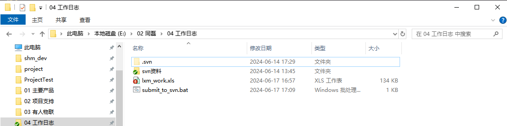
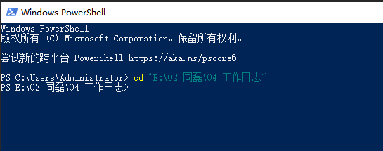
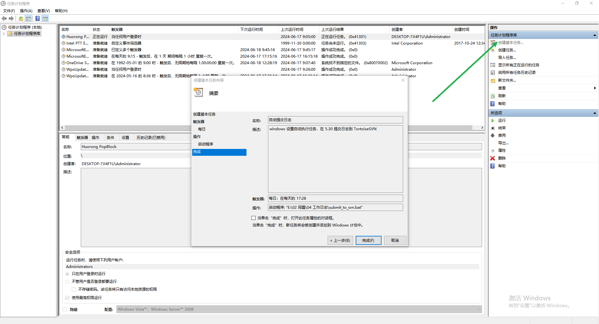
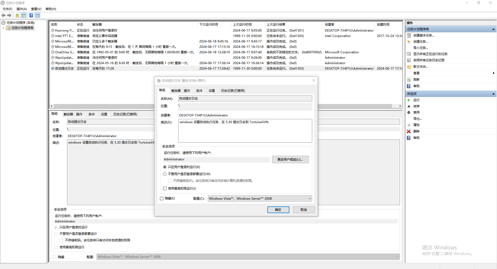

# 自动提交日志

## 需求

windows 设置自动执行任务，在 5.30 提交日志到 TortoiseSVN

## 步骤

### 创建脚本文件



打开文本编辑器（如记事本），输入以下命令并保存为 .bat 文件，比如 submit_to_svn.bat：

```bat
@echo off
cd "E:\02 同磊\04 工作日志"
svn commit -m "工作日志提交" --lxm --password 123456
```

- cd 命令用于切换到你的工作副本目录。
- svn commit 命令用于提交修改到 SVN。替换 "提交日志内容" 为你实际的提交日志信息。
- --username 和 --password 分别替换为你的 SVN 用户名和密码。

  

### 设置任务计划

::: info 操作步骤

- 在 Windows 桌面上，搜索并打开 任务计划程序。
- 在任务计划程序库中，选择 创建基本任务。
- 输入任务名称和描述，点击 下一步。
- 选择 每天 并点击 下一步。
- 设置任务应该启动的时间，选择 每天，并输入 5:30:00 AM。点击 下一步。
- 选择 启动程序 并点击 下一步。
- 在程序/脚本中输入批处理文件的完整路径，比如 C:\path\to\submit_to_svn.bat。点击 下一步。
- 点击 完成 完成设置。
  :::



### 配置安全选项

::: info 操作步骤

- 在任务计划程序中，右键点击你创建的任务，选择 属性。
- 在 常规 标签下，确保选择了 "使用最高权限运行"。
- 在 条件 标签下，确保 "启动任务时请勿强制计算机从休眠中唤醒" 是未选中的状态，以确保任务可以在计划的时间运行。
- 点击 确定 保存更改
  :::


