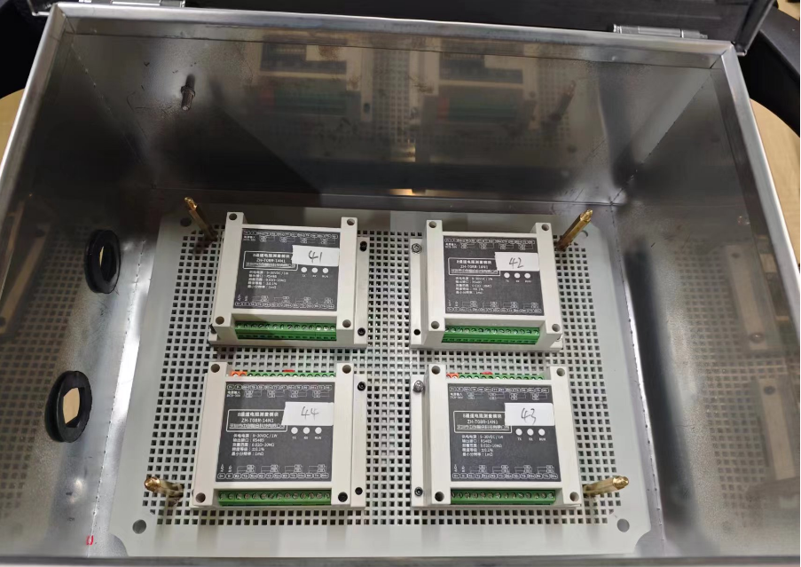
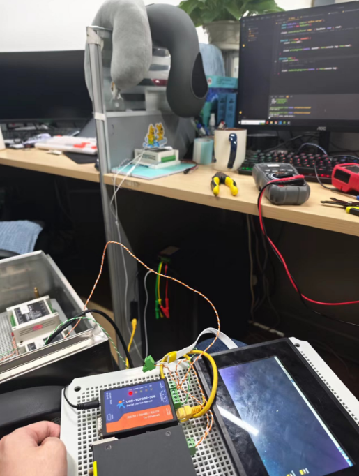
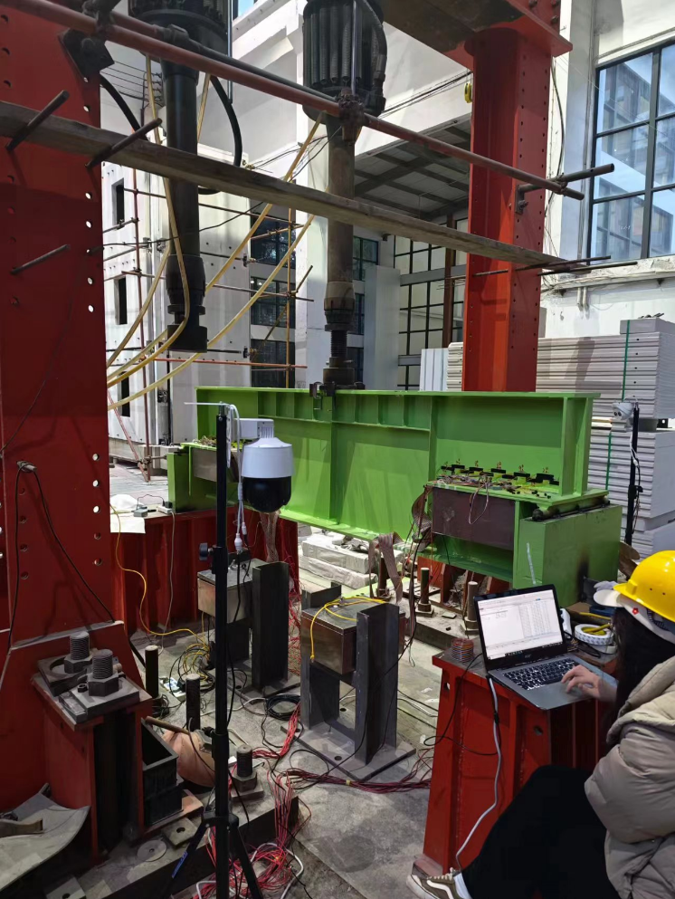
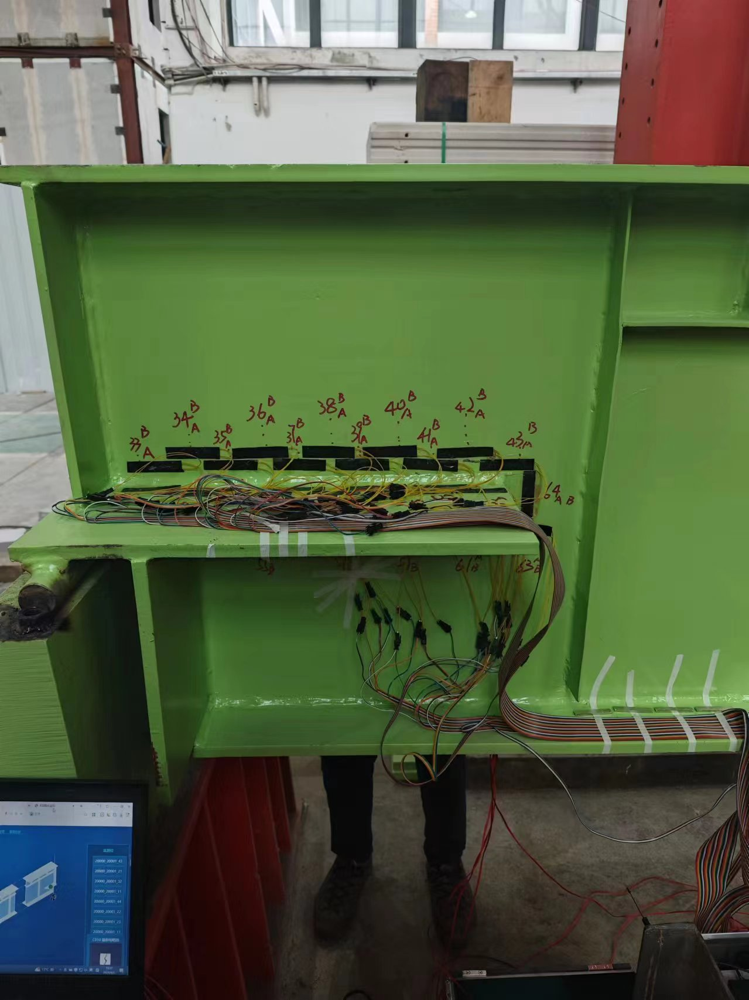
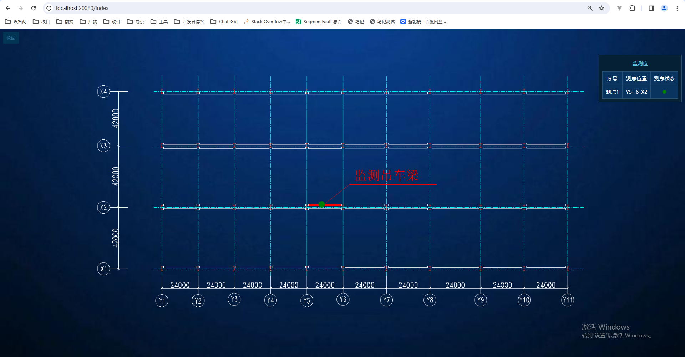
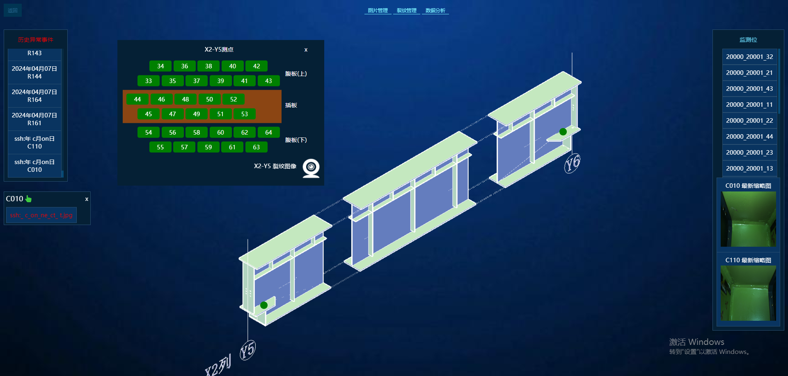
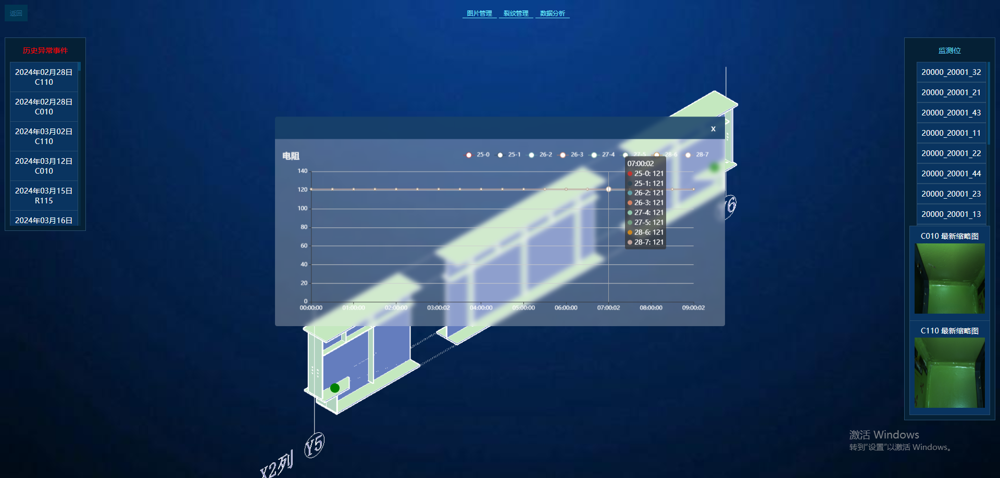
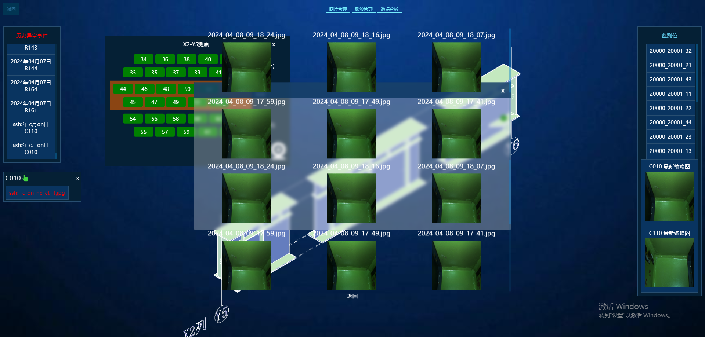

# 宝武裂缝监测

## 项目相关

### 参与人员

- 项目负责人：张金辉、杨彬

- 业主负责人：严工，王总

- 现场负责人：张涵

- 视觉监测：韩子成，张佳怡

## 产品开发

### 硬件连接

4G 路由

- IP ：192.168.30.1
- 账号：tonglei
- 密码：hxl_1599

485 串口服务器

- IP ：192.168.30.8

ubuntu

- IP ：192.168.30.200
- 账号：root
- 密码：root

3 个摄像头

- IP ：192.168.30.15/17/19（大）
- 账号：tonglei
- 密码：hxl_1599

### 软件测试

[8 通道电阻测量模块](../../../work/devices/ZH-T08R-14N1/strain-8R)

## 项目阶段

### 沟通完善

应变片宝武要求：
1.ICMS 接线需要采用 4 芯屏蔽线，一边 48 根
采购、品牌
#@=> https://item.jd.com/10044582971187.html 起帆

2.屏蔽线走线图以及 ICMS 应变片粘贴位置与编号
线槽、初始方案
#@=> 在画

3.采集箱尺寸与开孔还需要确认
一层，开孔位置—排成一排
#@=> 有开口器和封线接头

4.线束固定方式
线槽、磁铁固定
#@=> 要采购一小段测试

5.采集箱电源适配器更新
从主箱出线到视觉盒子
#@=> 在画 一根网线 一根电源线(0.75 或 1 平方双线)

6.保护层涂刷
避开区域、环氧树脂胶透明
#@=> 画图确认

最终送给宝武前的准备： 1.应变片制备：96 个，至少需要 300 个应变片 2.采集模块：一边 12 个，还需采购 12 个 3.环氧树脂胶水：采购 5 只 4.用于吸附固定用的磁铁：需采购 200 块 5.聚酰亚胺覆膜材料 6.接线端子（更换）4.3 确定方案：公母各需 500 套 7.采集箱开孔附件（张金辉老师） 8.环氧树脂胶（保护用） 9.线槽 先买一段
#@=> 要采购一小段测试 10.线槽固定用的磁铁

1.电源适配器更新 2.电源和网络了解的方式：
确认一下盒子位置、走线；有线连接、孔 8mm—热熔胶风封堵
#@=> 或开口用塑料接线口 3.盒子竖向布置固定 jetson：
新盒子打孔位置、布线；一种规格开 2 孔

软件加报警灯

待宝武确认：
1）需要宝武方提供一个熟悉现场电路情况的电工，配合确定方案。
2）电源需要有接地的三芯线。给的线是否有插头？
3）需要确定现场裂缝采集电箱具体放置的位置，并了解现场条件限制，比如开门方式、方向，电箱的高度、厚度条件等，方便维护。

### 疲劳试验

构件开机 40t 满载测试性能，预计测试 1 个小时左右

### 监测系统

## 日志记录

### 02-26：电阻采集模块测试

### 02-27：编写 modbus 测试程序

### 03-25：组装实验箱

### 04-01：演示：严工，王总

### 04-07：同济实验室疲劳实验

### 05-15：组装采集箱
