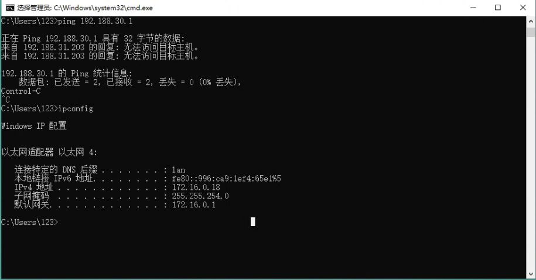

# 滨州体育

## 项目相关

### 参与人员

- 项目负责人：周赵领

- 现场负责人：白良、肖国刚

- 系统调试：陆徐栋

### 后端信息

- 服务器：现场服务器

- 数据库：tl-binzhou

- 网址：<http://123.206.175.241:50868/>

## 传感设备

### 服务器

位置：消控制

### 路由器

肖国刚：购买路由器接入业主家网络

密码：bingzhou123

### 网络走线

### 交换机

问题：交换机低温失联

处理：更换工业级交换机

## 日志记录

### 231023：明确现场网络布置

白良

### 2401205：交换机失联

齐辉

### 240402: 网络恢复

问题：业主的路由被替换

肖国刚：购买路由器接入业主家网络

密码：bingzhou123
