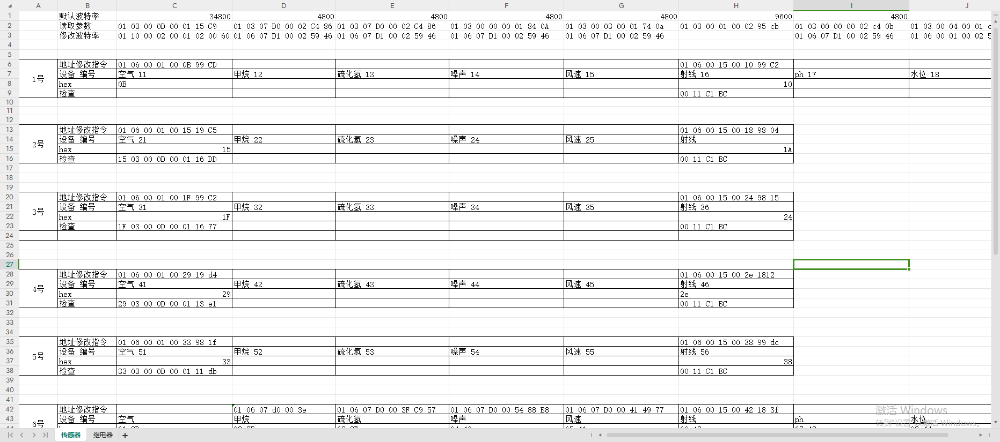
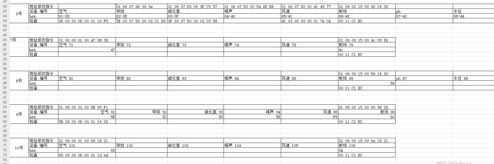
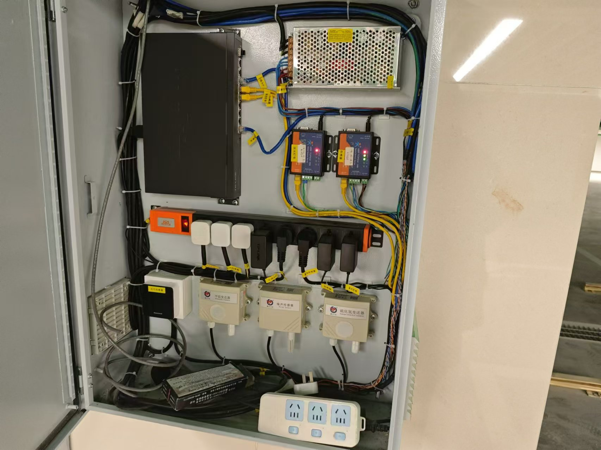
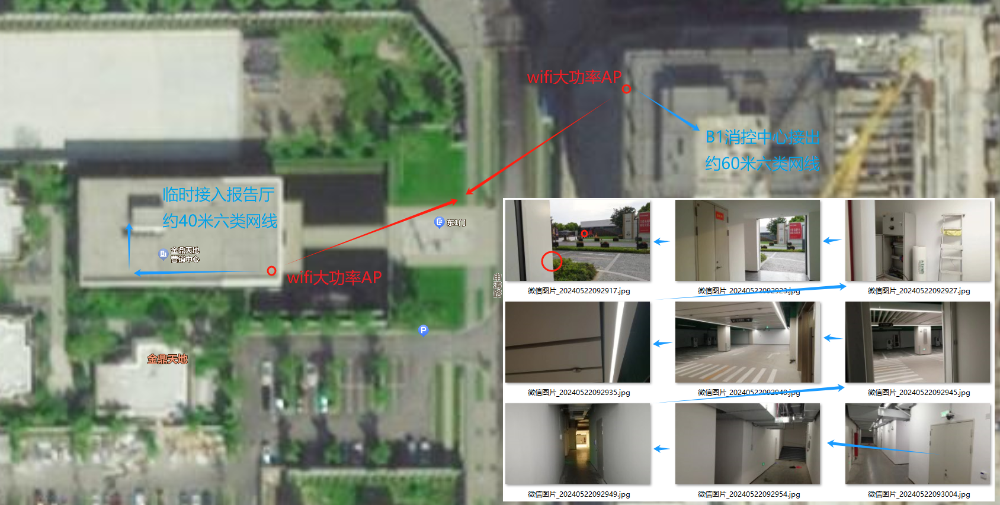
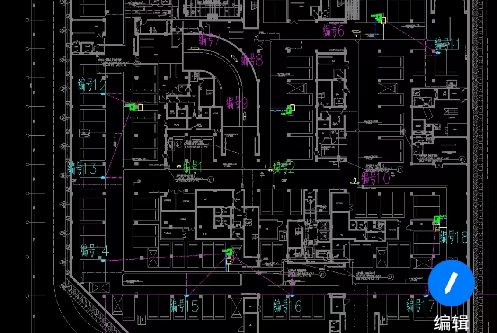
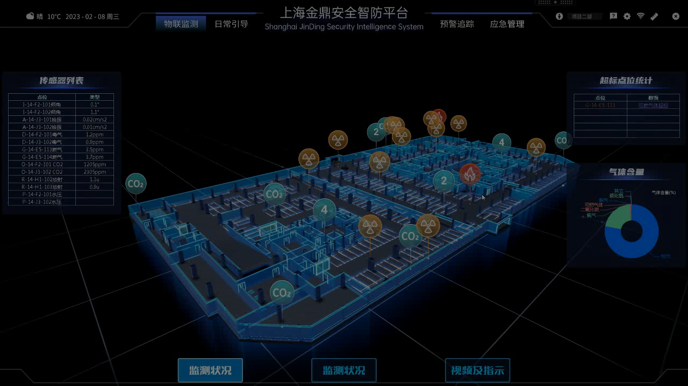
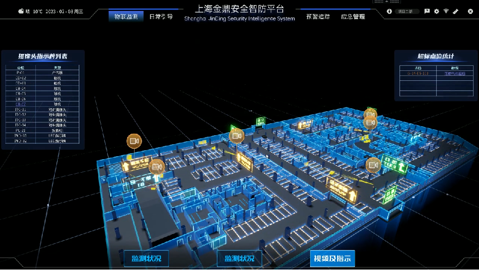

# 上海金鼎天地

## 项目信息

### 参与人员

- 主要单位：民防中心、同济设计院、智慧停车

- 项目负责人：张金辉老师

- 现场负责人：何庆辉、陈建

### 后端信息

- 服务器：123-50682

- 网址：

## 设备配置

### 网络布局

- 从人防接外网

- 从智慧停车接局域网，连接设备

- 于消控室合并两组网络

### 子站箱

1-10 号

### 大功率 AP

- 根据现场情况，准备临时拉两根网线，跨马路 100 米左右，准备用大功率 AP 对接。

- 完成汇报后撤掉

## 测点排布

## 监测系统

## 日志记录

### AP 点位现场踩点预估

日期：2024.05.21
