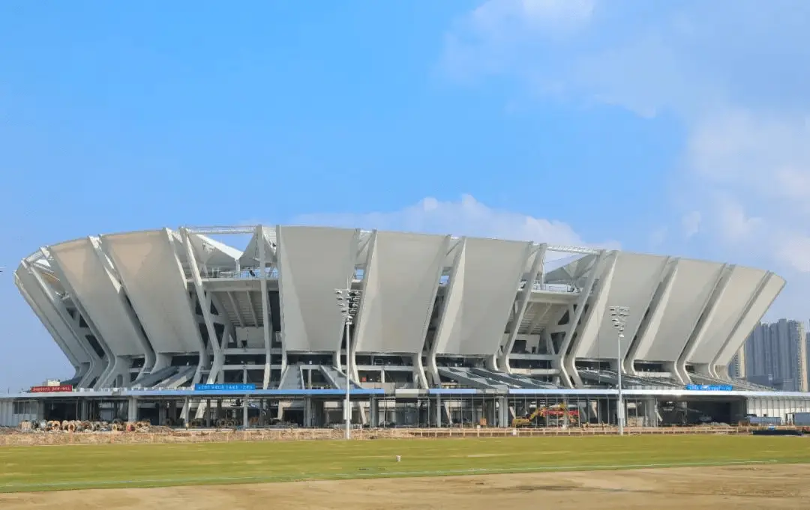
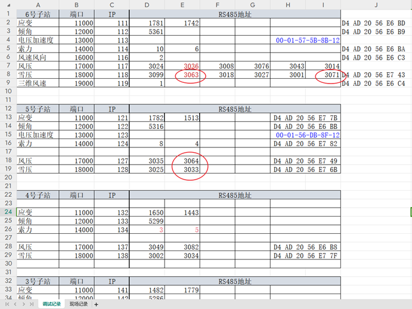
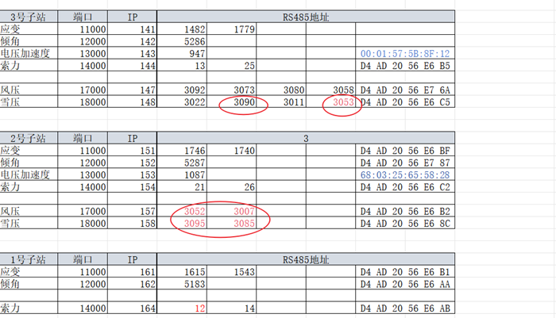

# 昆山足球场

## 项目信息

### 参与人员

- 项目负责人：黄博、周赵领

- 现场负责人：齐辉、何庆辉

### 后端信息

- 服务器：123-50532

- 数据库：tl-kunshan

- 网址：<http://123.206.175.241:53319/>

## 设备配置

## 测点排布

## 项目阶段

### 更改风压雪压方案

2024.05.24 风压雪压调试

问题 1：两台（1782、1583）应变采集仪数据不符或数值不变

解决：更换为（1762、1383）

问题 2：应变通道数据异常

解决：重新接线，部分恢复

问题 3：风压雪压部分失联，恢复部分后，任有 10 台无法连接上。

原因：

- 3036、3014 为电源正负极接反，已更正；

- 线路过长，导致 485 通讯出现问题，增加电阻后也没有效果；

- 2 号子站未接信号线；

方案：全部改用 lora

## 日志记录

### 2024.05.24 风压雪压调试

何庆辉

### 2024.05.27 沟通制定风压雪压修改方案
