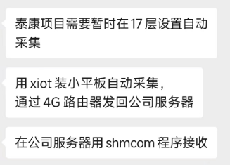
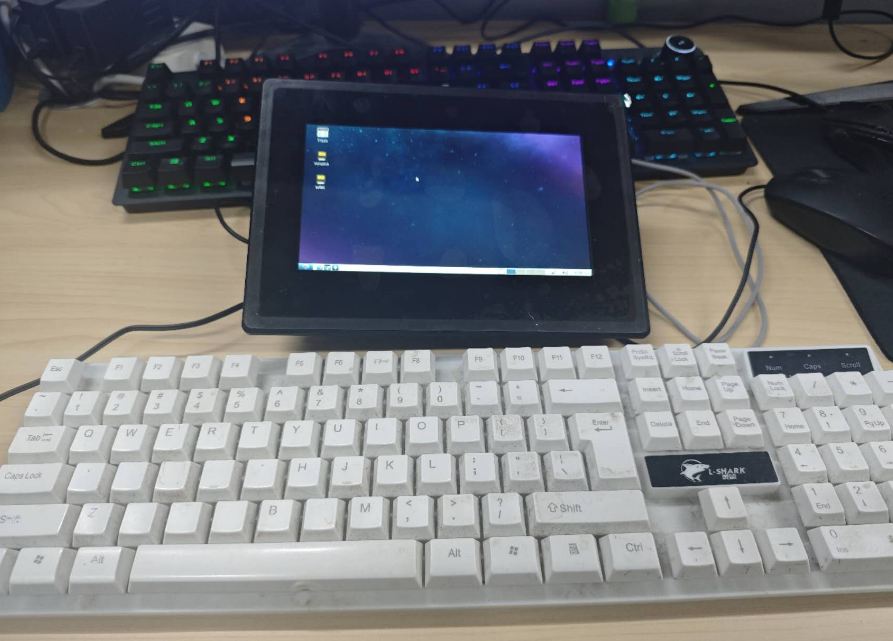
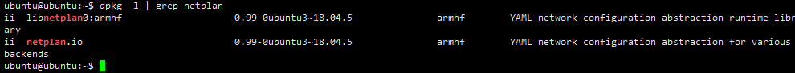

# 泰康

## 项目相关

### 参与人员

- 项目负责人：周赵领

- 现场负责人：王亚栋

## 项目阶段

### 临时系统



需求：暂时在 17 层设置自动采集

方案：

- 用 xiot 装小平板自动采集，通过 4G 路由器发回公司服务器

- 在公司服务器用 shmcom 程序接收

#### 小平板



小平板密码同账号

- ubuntu 密码：ubuntu

- root 密码：root

#### ip 修改不成功

问题：无法手动获取静态 ip

原因：系统未安装 netplan

要检查 netplan 是否安装，你可以使用命令行工具 dpkg（Debian 或 Ubuntu 系统）或 rpm（CentOS 或 Fedora 系统）来查询。以下是针对不同 Linux 发行版的命令：

对于基于 Debian 的系统（如 Ubuntu）:

```sh
dpkg -l | grep netplan
```

如果 netplan 已安装，这些命令将输出 netplan 的版本信息。如果未安装，它们将不会显示任何信息或显示“未找到”（在 Debian/Ubuntu 中）或显示未安装（在 CentOS/Fedora 中）。



安装 netplan

```sh
sudo apt update
sudo apt install netplan.io

```

#### 串口服务器

192.168.30.7-12 端口：12000


## 日志记录

### 2024.03.20：配置 485

初始化 6 个 485 模块：

### 2024.03.25：倾角测试

教王亚栋测试倾角仪
