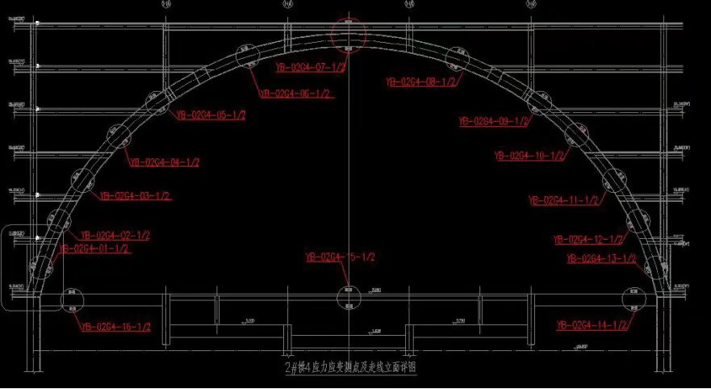
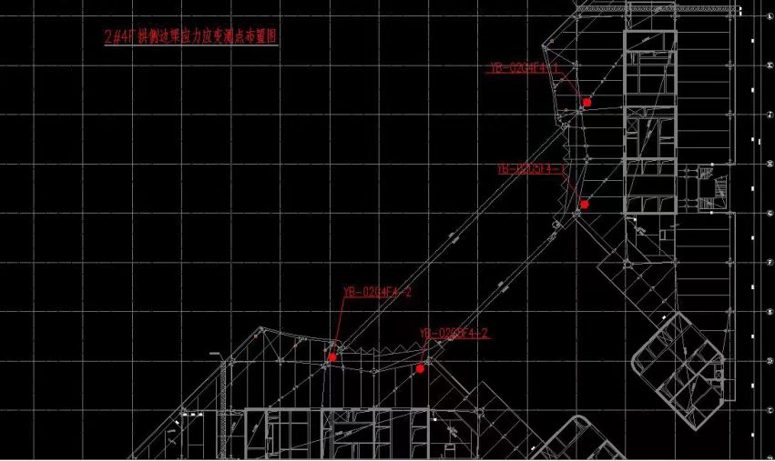
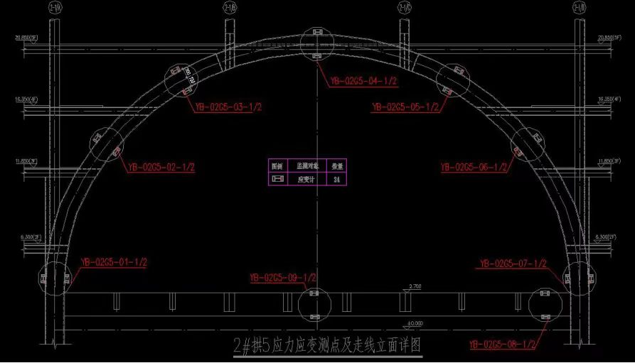
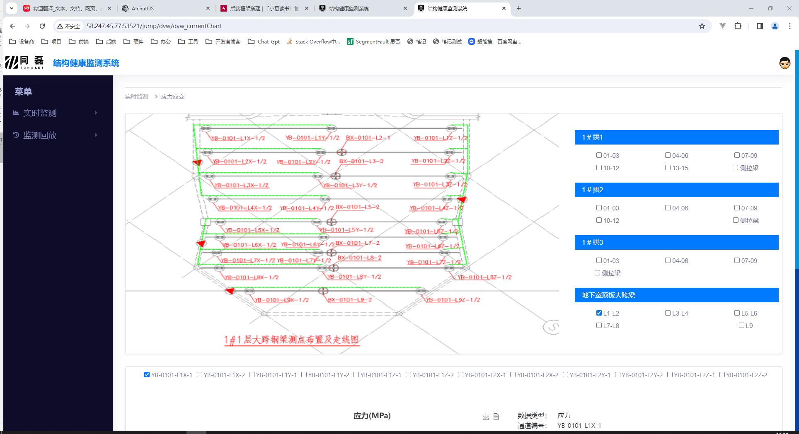

# 杭州 vivo 全球 AI 研发中心钢结构工程 -健康监测

## 项目相关

### 参与人员

- 项目负责人：周赵领

- 现场负责人：齐辉、解新宇

### 后端信息

- 服务器：iot5 —— tl-vivo

- 数据库：tl-vivo

- 网址：<http://58.247.45.77:53521/>

## 测点

### 地下室

### 1 # 楼

### 2 # 楼

## 日志记录

### 2024.02.01 地下室设备添加

解新宇

### 2024.04-25 2# 楼设备添加
