# 杭州 vivo 全球 AI 研发中心钢结构工程 -健康监测

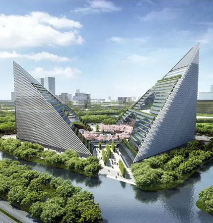

## 项目相关

### 参与人员

- 项目负责人：周赵领

- 现场负责人：齐辉、王亚栋、解新宇、陈建国

### 后端信息

- 服务器：iot5 —— tl-vivo

- 数据库：tl-vivo

- 网址：<http://58.247.45.77:53521/>

## 测点排布

主要划分为 四大区域：

一、巨 拱

- 拱 1
- 拱 2
- 拱 3
- 拱 4 （2024.05.07）
- 拱 5 （2024.05.07）

二、地下室 （在我之前）

三、楼 1

四、楼 2

### 地下室

采集仪：

#### 3105

#### 1389（原 3106）

#### 1366（原 3109）

#### 3084

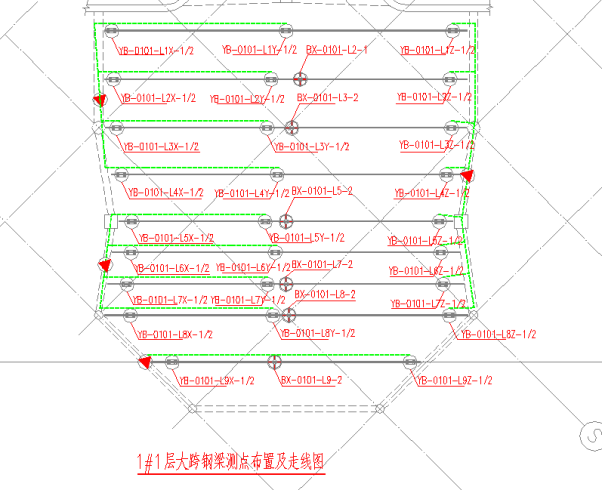

### 1 # 楼 拱 1 2 3

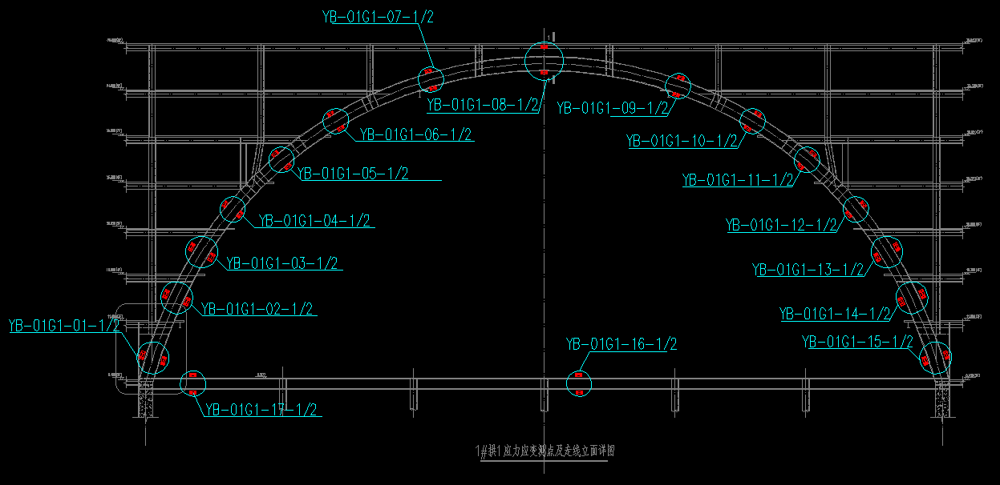

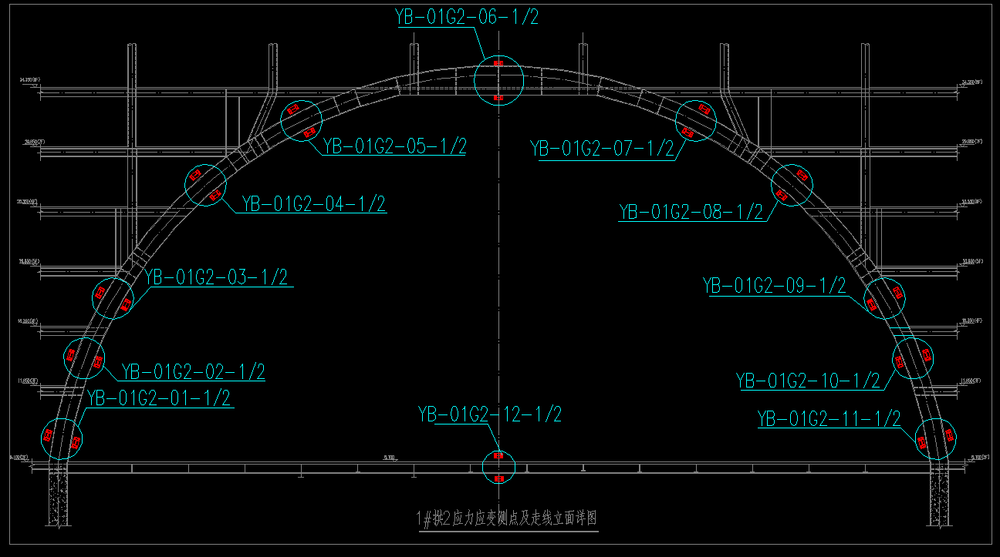

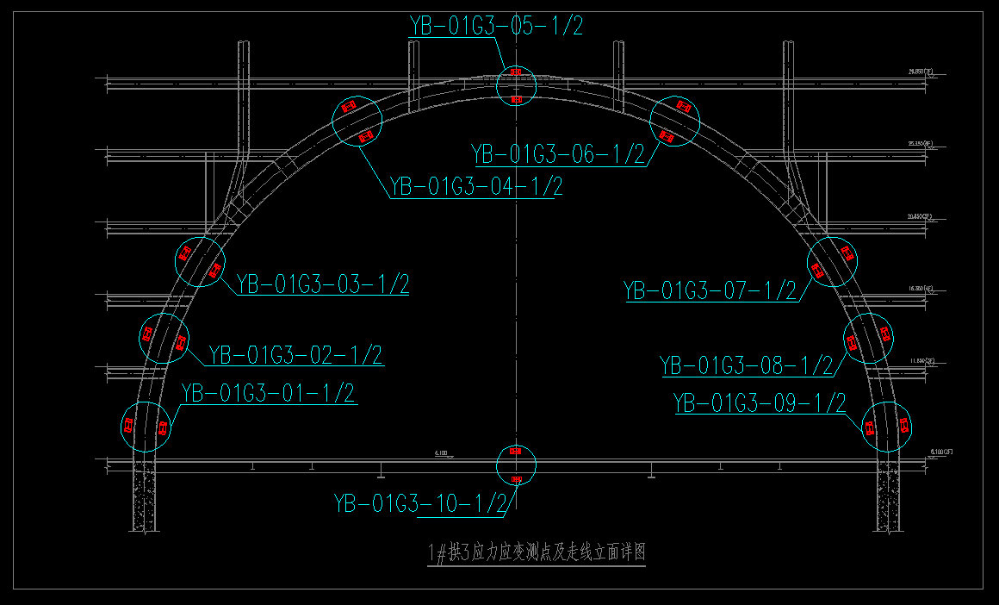

采集仪：

#### 3167 - G1

#### 1384 - G1（原 3178 更换）

#### 3165 - G2

#### 3179 - G2

#### 3166 - G3/1

#### 1386 - G3（原 3164）

### 2 # 楼 拱 4 5

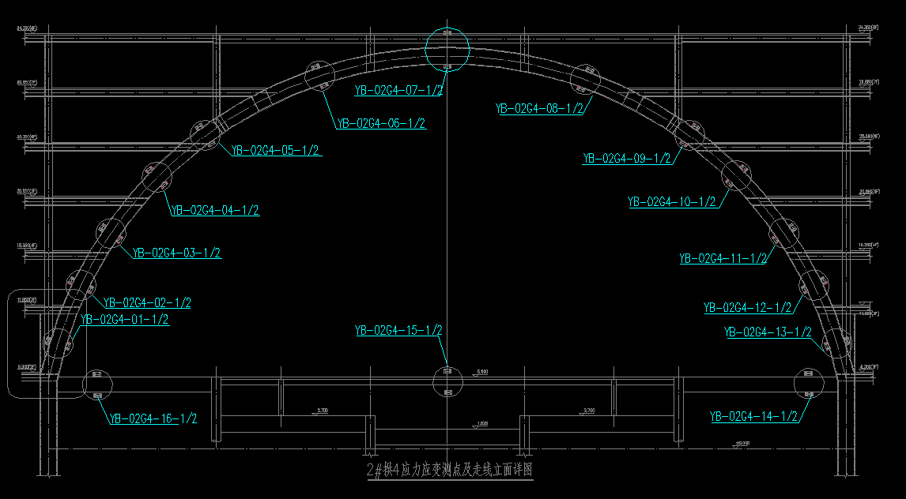

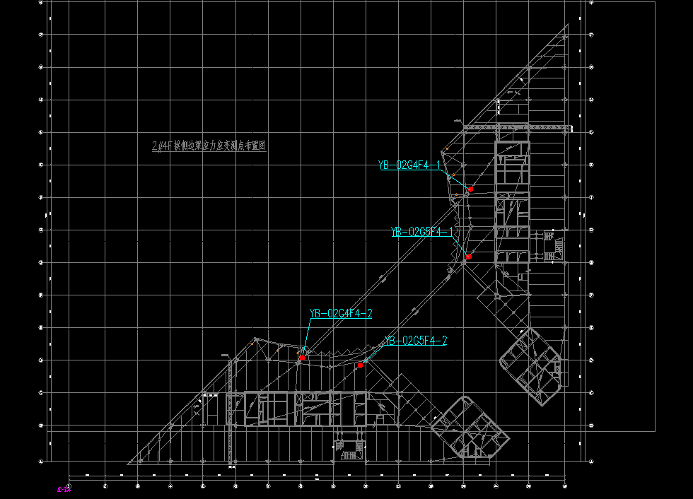

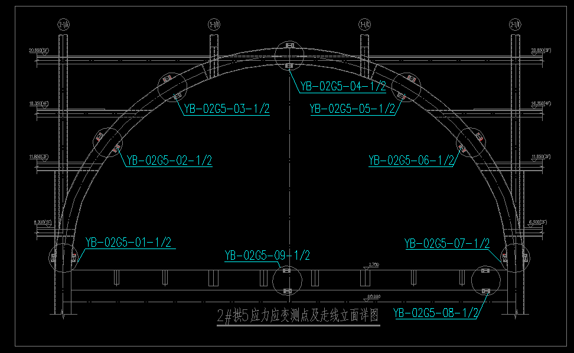

采集仪：

#### 3190 - G4

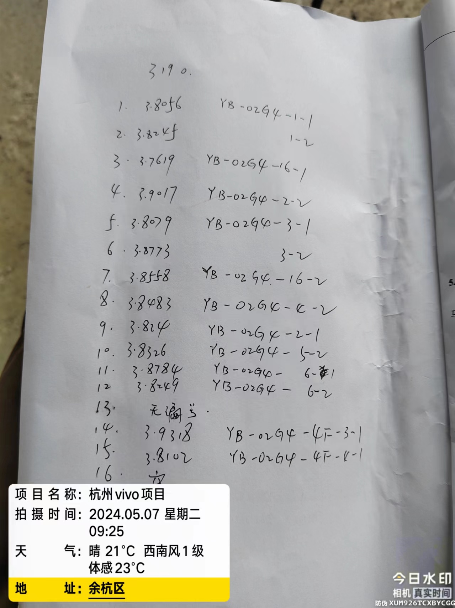

#### 3192 - G4（原 3168）

#### 3196 - G4

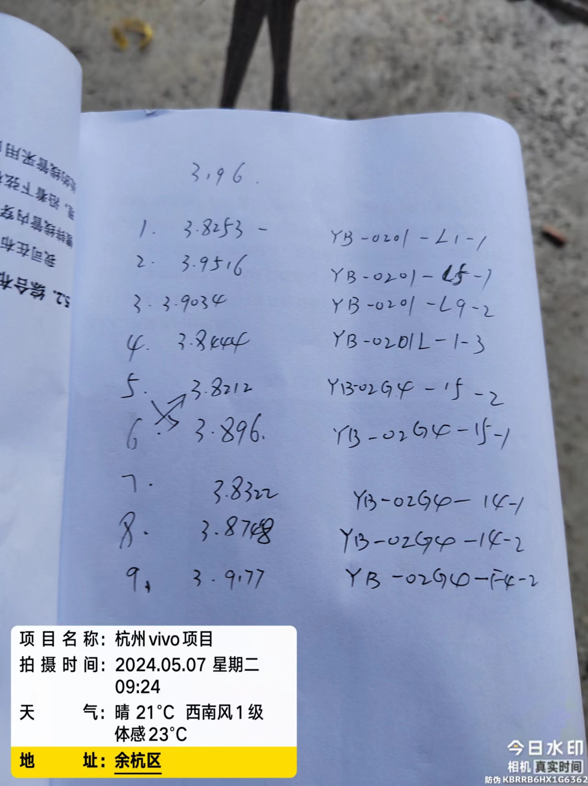

#### 1367 - G5（原 3176）

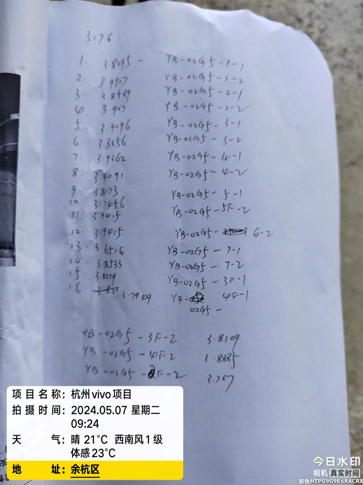

### 5 层桁架

#### 3173

图片标记错误

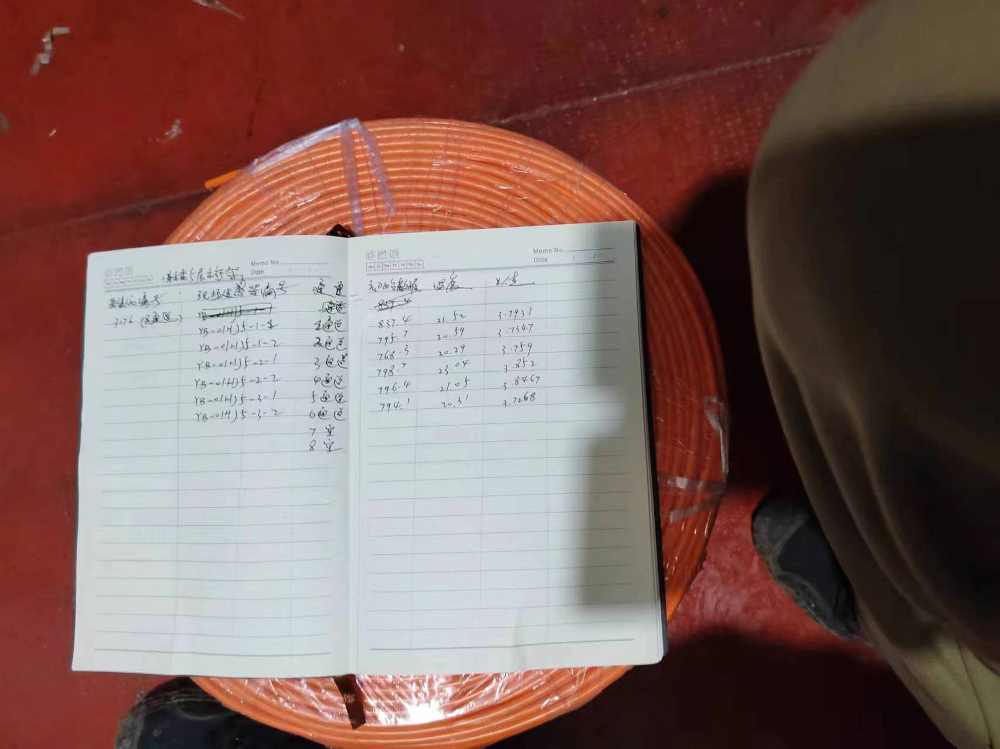

### 1 层平台

#### 3243

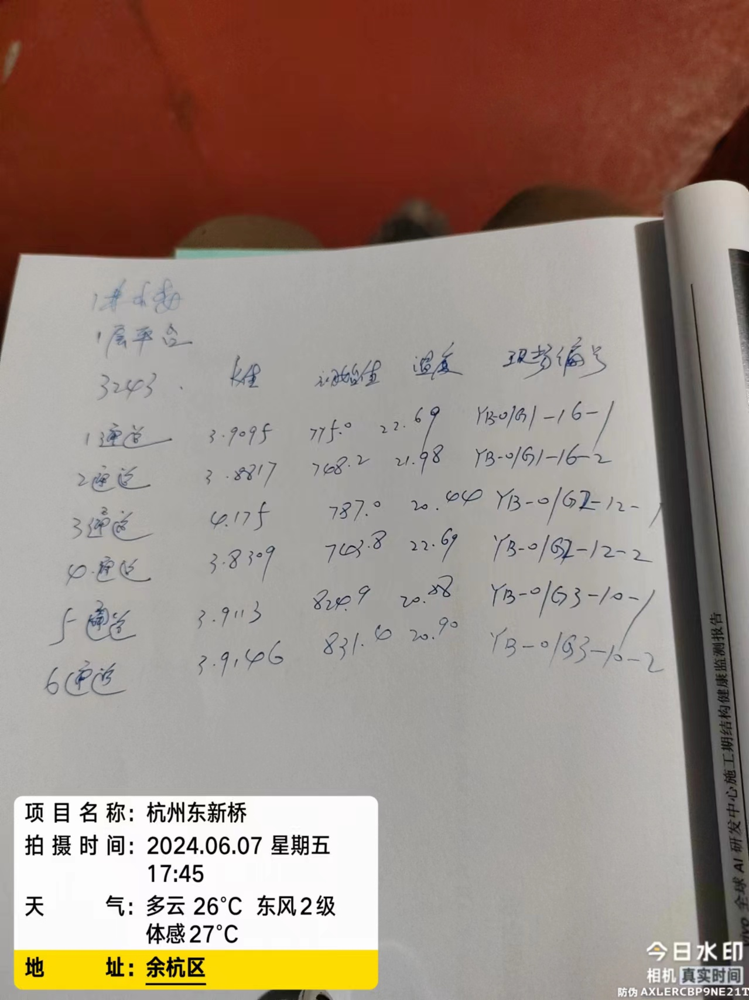

## 存在问题

### 设备数据重复

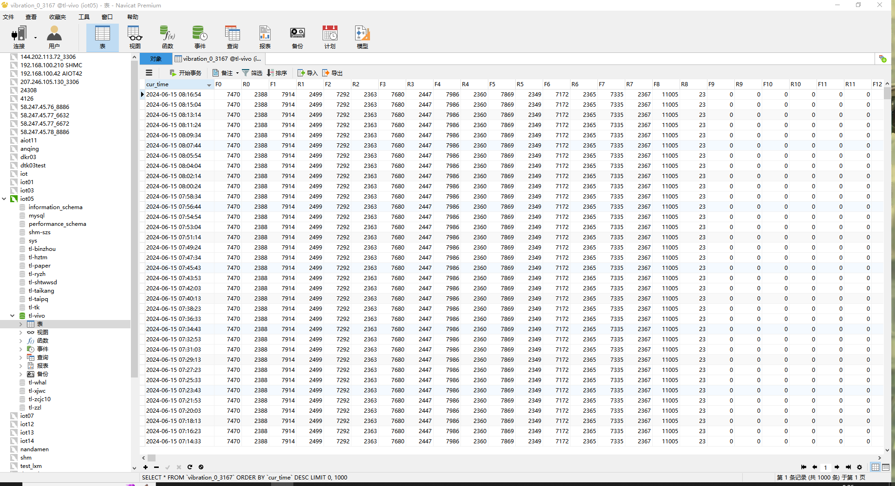

## 日志记录

### 2024.01.15 采集系统部署

### 2024.02.01 地下室设备添加

先恢复采集，后添加-解新宇

### 2024.04.22 2# 楼 拱 4、5 调试

陈建国

### 2024.05.07 2# 楼 拱 4、5

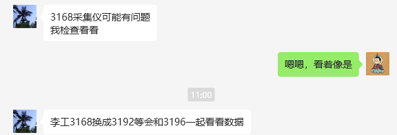
