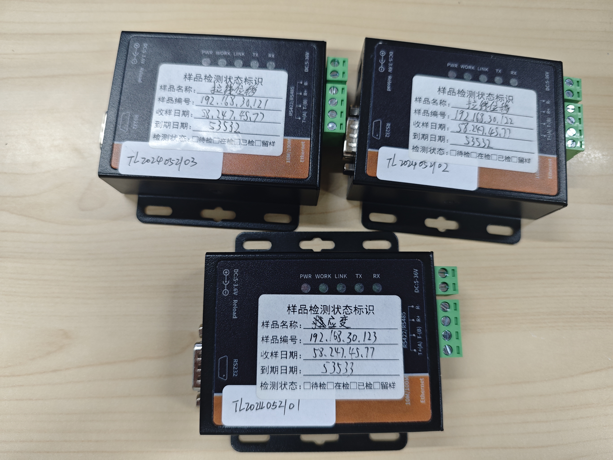
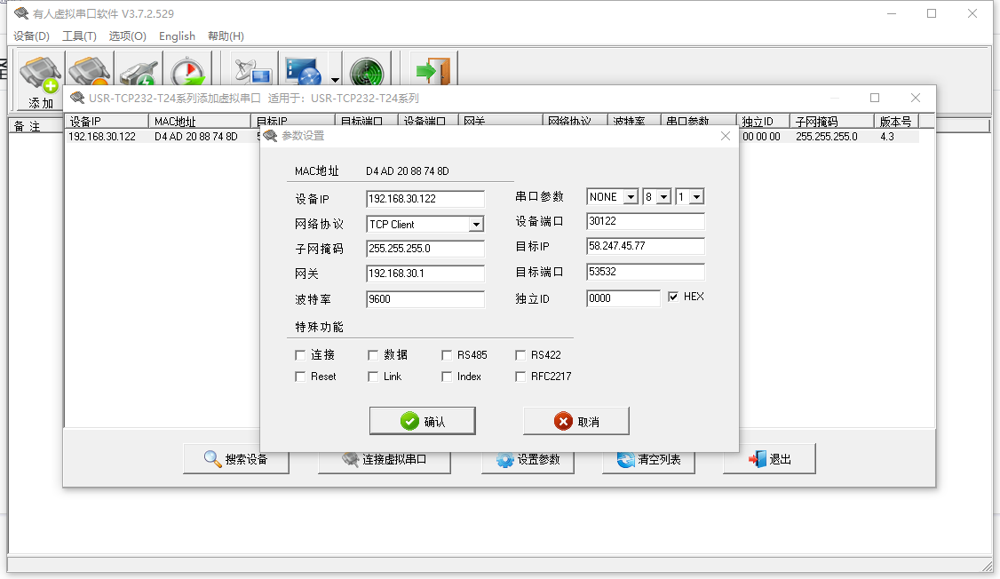
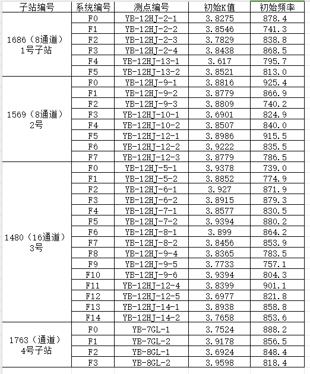
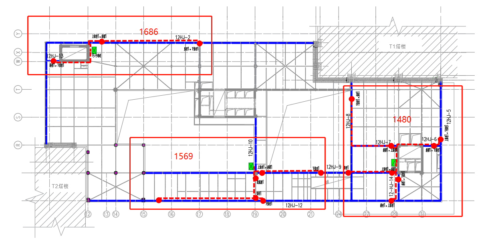
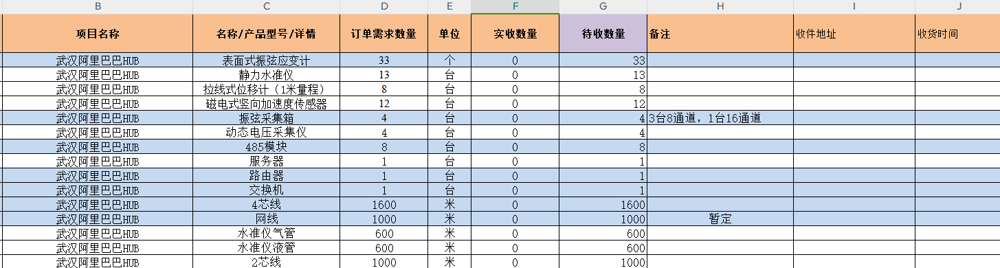

# 武汉阿里

## 项目信息

### 参与人员

- 项目负责人：刘霍义

- 现场负责人：陈建、王亚栋

### 后端信息

- 服务器：iot05

- 数据库：tl-whal

- 网址：58-58531

## 设备配置

### 路由器

2024.05.22

密码：h_9

### 485

2024.05.22

### 传感设备

## 测点排布

## 日志记录

### 2023.08.23：编写设备清单

### 2023.09.21：系统调试

### 2024.01.26：配置系统参数供技术编写报告

刘霍义

### 2024.05.22：设备配置

1 个 4G 路由、3 个 485
