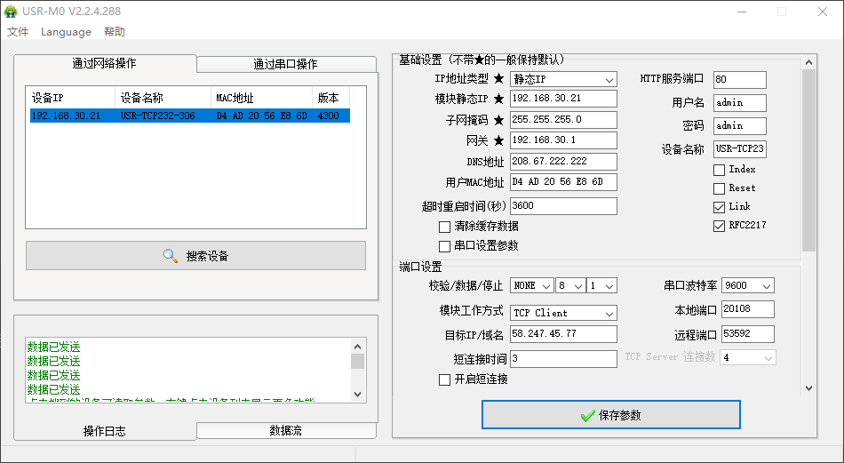
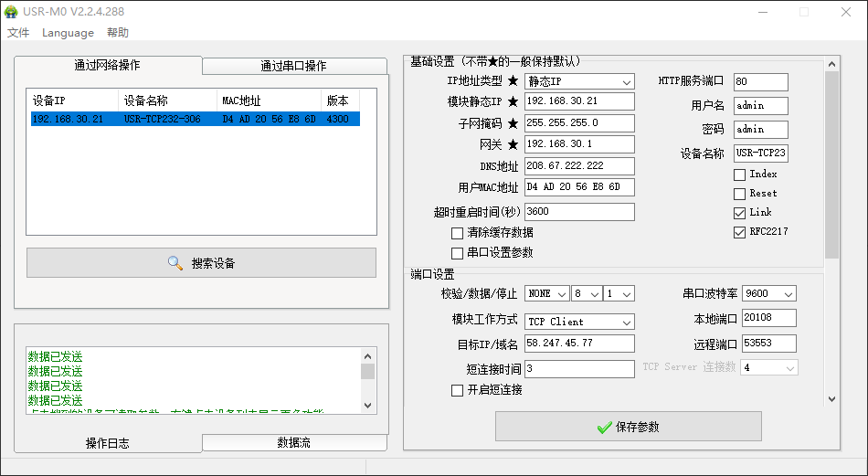

# 新天地

::: warning 项目进度
2024.04.17 等待安装，项目已分配端口，未搭建系统，只看应变数据就行
:::

## 项目相关

### 参与人员

- 项目负责人：邓立云

- 现场负责人：何庆辉

### 后端信息

- 服务器：iot05

- 数据库：tl-xintiandi

- 网址：<http://58.247.45.77:53591/>

## 设备配置

### 485 串口服务器

配置参数

原始配置（激光）

## 日志记录

### 202403.27：

### 2024.04.17：路由、lora 配置

1 台 4G 路由，6 台 lora，1 个 485
