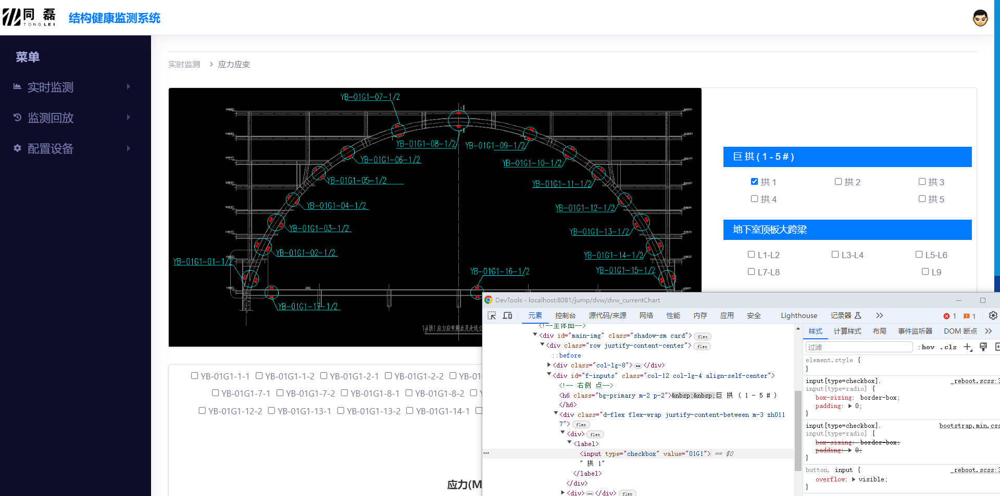
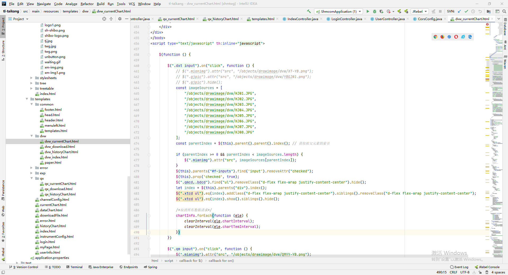

# 通用函数

## tcp

```js
function net() {
  var obj = {};
  //  ---- Socket ------------------------------------------------
  var socketServer = null,
    clients = {}; // ctrl = "\x1b"
  obj.openSocketServer = function openSocketServer() {
    var hdl = arguments[0] ? arguments[0] : cnnHandle;
    var host = arguments[1] ? arguments[1] : "localhost";
    var port = arguments[2] ? arguments[2] : 4004;
    socketServer = new require("net").Server();
    socketServer.on("error", function (err) {
      if (err.code == "EADDRINUSE") console.log("Port " + port + " in use!");
      else console.log("srv_err:\n" + err.stack);
      obj.closeSocketServer();
    });
    socketServer.on("connection", function (client) {
      var remoteIpPort = client.remoteAddress + ":" + client.remotePort;
      clients[remoteIpPort] = client;
      console.log(remoteIpPort + " connected");
      client.on("error", function (err) {
        console.log("clt_err:\n" + err.stack);
        obj.closeClient(remoteIpPort);
      });
      client.on("close", function () {
        console.log(remoteIpPort + " closed");
      });
      client.on("end", function () {
        console.log(remoteIpPort + " ended");
      });
      client.on("data", function (data) {
        var buf = new Buffer(data);
        // console.log("receive from " + remoteIpPort + " len: " + buf.length);
        hdl(remoteIpPort, buf);
      });
      hdl(remoteIpPort);
    });
    socketServer.listen(port, host, function () {
      socketServer.curPort = port;
      console.log("Socket " + port + " listening...");
      hdl();
    });
    function cnnHandle(cltNo, buf) {
      if (!cltNo) console.log("cnnHandle!");
      else {
        if (!buf || !buf.length) console.log("cnnHandle: " + cltNo);
        else
          console.log(
            "cnnHandle: " + cltNo + " | receive: " + buf.toString("hex")
          );
      }
    }
  };
  obj.closeSocketServer = function closeSocketServer() {
    var srv = arguments[0] ? arguments[0] : socketServer;
    try {
      if (srv)
        srv.close(function () {
          console.log(srv.curPort + " listen stopped!");
        });
    } catch (e) {
      console.log("closeSocketServer: err:" + e.stack);
    }
    for (var k in clients) obj.closeClient(k);
  };
  obj.closeClient = function closeClient(cltNo) {
    try {
      if (cltNo && clients[cltNo]) {
        clients[cltNo].end();
        clients[cltNo].destroy();
      }
    } catch (e) {
      console.log(
        "closeClient: " +
          clt.remoteAddress +
          ":" +
          clt.remotePort +
          " err:" +
          e.stack
      );
    }
  };
  obj.writeClient = function writeClient(buf, cltNo) {
    try {
      if (buf) {
        if (cltNo && clients[cltNo]) clients[cltNo].write(buf);
        else console.log("客户端连接指定无效");
      } else console.log("指定传输数据为空");
    } catch (e) {
      console.log("writeClient: " + cltNo + " err:" + e.stack);
    }
  };
  //  ------------------------------------------------------------
  return obj;
}
```

这段代码是一个 Node.js 中用于创建 TCP 服务器的模块，通过 Node.js 的 net 模块实现了一个简单的 TCP 服务器，并提供了一些操作该服务器的方法。下面是对这段代码的详细分析：

### net() 函数

::: info net()

定义了一个名为 net 的模块，该模块包含了一系列函数和变量，并最终返回一个包含这些函数和变量的对象 obj。

在 net 模块中，首先声明了一个空对象 obj，用于存放后续定义的函数和变量。
:::

### openSocketServer

::: info openSocketServer()
函数用于创建并开启一个 TCP 服务器。该函数接受三个可选参数：回调函数 hdl、服务器主机地址 host 和端口号 port。如果未提供参数，则会使用默认值。

在该函数内部，通过调用 require("net").Server() 创建了一个 TCP 服务器实例 socketServer，并通过 socketServer.on() 方法监听了服务器的 error 事件和 connection 事件。

当有客户端连接到服务器时，会触发 connection 事件，并执行相应的回调函数。回调函数中处理了客户端连接的各种事件，包括 error、close、end 和 data 事件，并调用传入的 hdl 函数处理接收到的数据。
:::

### closeSocketServer

::: info closeSocketServer()
用于关闭 TCP 服务器。它接受一个可选参数 srv，默认值为 socketServer，即要关闭的服务器实例。在函数内部，通过调用服务器实例的 close() 方法关闭服务器，并关闭所有已连接的客户端。
:::

### closeClient

::: info closeClient()
函数用于关闭指定的客户端连接。它接受一个参数 cltNo，表示要关闭的客户端连接的编号。在函数内部，通过调用客户端连接的 end() 和 destroy() 方法关闭客户端连接。
:::

### writeClient

::: info writeClient()
函数用于向指定的客户端发送数据。它接受两个参数：要发送的数据 buf 和目标客户端的编号 cltNo。在函数内部，通过调用目标客户端的 write() 方法发送数据。

在函数的最后，返回了包含所有定义的函数和变量的对象 obj，作为模块的导出。
:::

## 更换图片



```js
const imageSources = [
  "/objects/drawimage/dvw/HJ01.JPG",
  "/objects/drawimage/dvw/HJ02.JPG",
  "/objects/drawimage/dvw/HJ03.JPG",
  "/objects/drawimage/dvw/HJ04.JPG",
  "/objects/drawimage/dvw/HJ05.JPG",
  "/objects/drawimage/dvw/HJ06.JPG",
  "/objects/drawimage/dvw/HJ07.JPG",
  "/objects/drawimage/dvw/HJ08.JPG",
];
const parentIndex = $(this).parent().parent().index(); // 获取祖父元素的索引

if (parentIndex >= 0 && parentIndex < imageSources.length) {
  $(".mianimg").attr("src", imageSources[parentIndex]);
}
```


