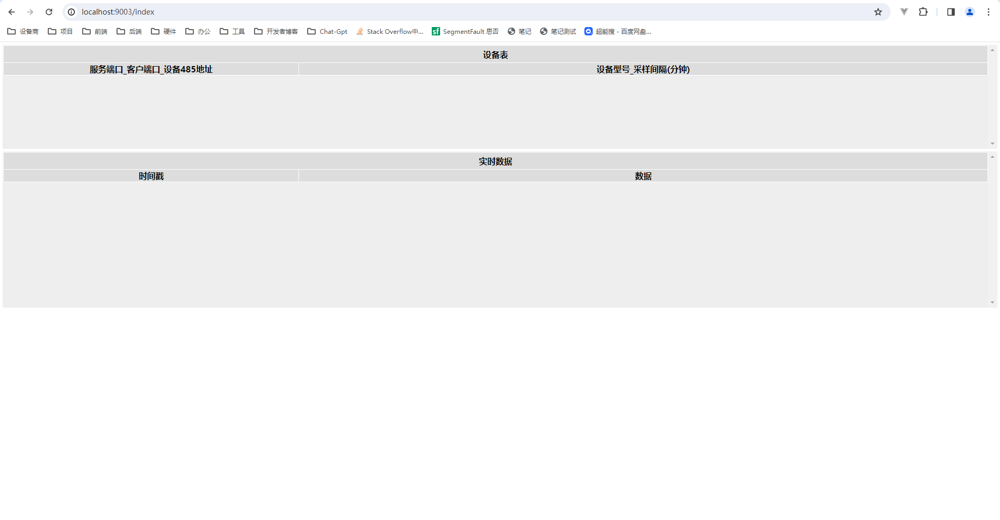

# xiot 系统

## 前端首页

index.html



```html
<html xmlns:th="http://www.thymeleaf.org"></html>

<tr th:each="cfg:${cfgs}">
  <td th:text="${cfg[0]}" class="lnk">device code</td>
  <td th:text="${cfg[1]}">device</td>
</tr>
```

::: tip
使用 Thymeleaf 模板语法（th:each、th:text）来动态渲染设备表中的数据
:::

```js
<script type="text/javascript">
$('document').ready(function(){
/*<![CDATA[*/
	var types = [(${types})];
/*]]>*/
	$(".lnk").click(function(){
		var act = {dev:this.innerHTML,typ:this.parentNode.children[1].innerHTML};
		var str, devCfg, lst, dt, vals;
		$.get("indexact",act,function(data) {
			if (data.sts == "OK")
			{
				console.log(data);
				devCfg = types[act.typ.split("_")[0]].split("~")[3].split("_");
				if (devCfg.length > 5)
				{
					devCfg[4] = +devCfg[4];
					devCfg[5] = +devCfg[5];
				}
				lst = [];
				for (var k in data.data)
				{
					vals = [];
					dt = (new Date(+k)).toLocaleString();
					if (devCfg.length > 5) for (var j=0; j<devCfg[4]; j++)
						vals.push(hex2float2(data.data[k].substr(j*devCfg[5]*2,devCfg[5]*2)).toFixed(3));
					else vals = data.data[k];
					lst.push([dt,vals]);
				}
				console.log(lst);
				lst.sort(function(a,b){ return (new Date(b[0]).getTime() - new Date(a[0]).getTime()); });
				console.log(lst);
				str = "";
				for (var k=0; k<lst.length; k++)
					str += "<tr><td>"+lst[k][0]+"</td><td>"+lst[k][1]+"</td></tr>";
				$("#data")[0].innerHTML = str;
			}
		});
	});
});
</script>
```

::: info
用于处理点击事件并向服务器发送请求获取数据，然后根据返回的数据动态更新页面内容。

- $('document').ready(function(){...}) 这是 jQuery 的文档加载完成后执行的函数，确保页面加载完成后再执行脚本。

- var types = [(${types})] 这里使用了模板语法${types}，它可能会被服务器端解析成一个变量或者表达式的值。在 JavaScript 中，这个值被用来初始化一个名为 types 的数组。

- $(".lnk").click(function(){...}) 这段代码添加了一个点击事件监听器，当类名为 lnk 的元素被点击时，执行相应的处理逻辑。

- $.get("indexact", act, function(data){...})  这是一个使用jQuery的$.get()方法发送 GET 请求的异步操作。请求的 URL 为 indexact，并且发送了一个包含 act 对象的请求参数。当请求成功返回时，执行传入的回调函数，并将返回的数据作为参数传递给回调函数。

- 回调函数内部处理了返回的数据，首先检查返回数据的状态是否为"OK"，然后根据接收到的数据进行相应的处理。

- 在处理数据时，将时间戳转换为可读的日期时间格式，并根据设备配置信息对数据进行解析和格式化。

- 最后将处理后的数据动态生成 HTML 表格，并插入到页面的指定位置。
  :::

## 入口文件

XiotApplication.properties

```java
package com.example.xiot;

import org.springframework.boot.SpringApplication;
import org.springframework.boot.autoconfigure.SpringBootApplication;

@SpringBootApplication
public class XiotApplication
{
	public static void main(String[] args) {
		SpringApplication.run(XiotApplication.class, args);
	}
}
```

这是一个 Spring Boot 应用的主类。让我解释一下其功能和结构：

::: info
包名和导入语句：

- package com.example.xiot —— 声明了包名。

- 导入了 Spring Boot 相关的类库。

@SpringBootApplication 注解：

- 这是一个组合注解，包含了多个注解的功能，包括 @Configuration、@EnableAutoConfiguration 和 @ComponentScan。

- @Configuration：标识该类为配置类，定义配置信息。

- @EnableAutoConfiguration：启用 Spring Boot 的自动配置功能，根据项目的依赖自动配置 Spring 应用。

- @ComponentScan：启用组件扫描，自动扫描并注册 Bean（组件）。

XiotApplication 类定义：

- 定义了一个名为 XiotApplication 的类，这是 Spring Boot 应用的主类。

main 方法：

- 这是 Java 应用程序的入口方法。

- public static void main(String[] args)：声明了一个静态的主方法，参数是一个字符串数组。

- SpringApplication.run(XiotApplication.class, args)：通过 SpringApplication 类的 run 方法启动 Spring Boot 应用，传入了主类 XiotApplication 和命令行参数 args。
  :::

总体来说，这个类是 Spring Boot 应用的入口点，通过 @SpringBootApplication 注解启用了自动配置和组件扫描，使得应用可以自动加载配置并启动。

## 配置文件

```json
// config.json
{ "11000_any_5316": "AIOT-HOR-01", "12000_any_222": "AIOT-WIND-01" }
// 11000_any_5316_2023052213.json
{"1684735080050":"1D35074186868341"}

// variable.json
{"11000_any_5316":"1712566800000","12000_any_222":"1712566800000"}

// type.json
{"AIOT-WIND-01":"康耐得~0_2~de0302580008_2__~14_8_14_8_1_2","AIOT-HOR-01":"静态倾角~0_2~D7EF0200001100000800F8D3_2__~14_8_14_8_2_8"}
```

| 传感器 |       编号       |                     意义 |      类型       |
| ------ | :--------------: | -----------------------: | :-------------: |
| 应变   | 14000_14050_1723 |   目标端口-本地端口-编号 |  AIOT-VW-16_1   |
| 电压   |   13000_62_976   | 目标端口 - 末位 IP- 编号 | AIOT-EXP-08_976 |

### config.json

```
{"14000_14050_1723":"AIOT-VW-16_1","14000_14090_3078":"AIOT-QJ-02_1","13000_62_976":"AIOT-EXP-08_976"}
```
