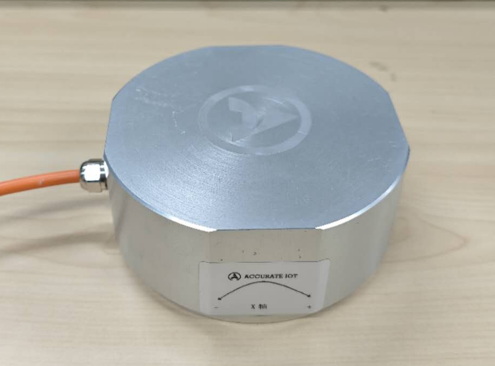
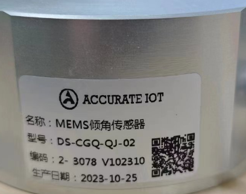
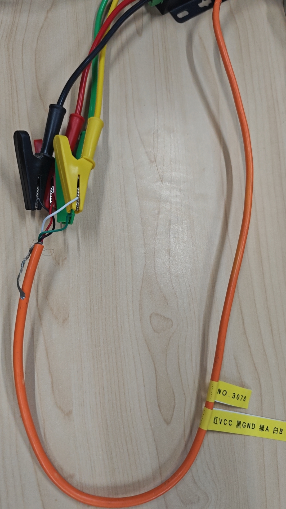
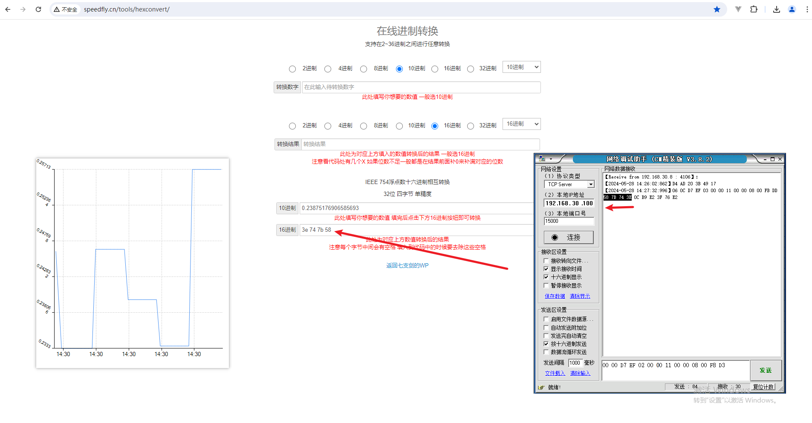
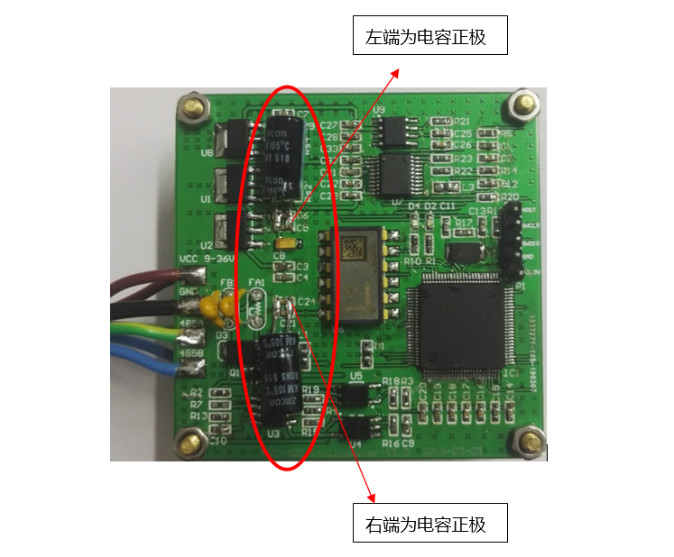

# 485 倾角仪

## 产品信息

 

连线

- 红：VCC
- 黑：GND
- 绿：485A
- 白：485B

范围：±30°

## 通信协议

### 读取采集数据格式

::: info PC 发送：64 00 D7 EF 02 00 00 11 00 00 08 00 F8 D3 (先发低位再发高位)

- 64 00:仪器地址（2 字节）,此处地址为 100 （或者为 00 00 ）注：仪器地址写 00 00 时所有已连接仪器都会回复
- D7 EF:包头 （固定）
- 02 00:命令字
- 00 11 00 00 :内存地址，即 4352
- 08 00 :请求读取的数据内容长度 即表示需要读取 8 个字节
- F8 D3:万能校验码（固定）
  :::

::: info 仪器回复（先发低位再发高位）：

64 00 1A D7 EF 03 00 00 11 00 00 08 00 +crc1（2 个字节）+x 轴角度（4 个字节，单位为度）+y 轴角度（4 个字节，单位为度）+crc2（2 个字节）

- 64 00 D7 EF：仪器地址（2 字节）+ D7 EF（固定，2 字节)
- 03 00：命令字(2 字节)
- 00 11 00 00：内存地址：4352 （4 字节）
- 08 00：数据长度（8 字节）表示 2 个 float 数据的长度
- crc 校验 1(2 字节) :从命令字开始算起（即 03 开始）
- 数据内容(8 个字节)：
- crc2(2 字节)，从数据内容开始算起
  :::

### 读取斜率补偿系数

::: info PC 发送：00 00 D7 EF 02 00 18 00 00 00 04 00 F8 D3

- 00 00:仪器地址（2 字节）（或者为 00 00 ）注：仪器地址写 00 00 时所有已连接仪器都会回复
- D7 EF:包头 （固定）
- 02 00:命令字
- 18 00 00 00 :内存地址，即 24
- 04 00 :请求读取的数据内容长度 即表示需要读取 4 个字节
- F8 D3:万能校验码（固定）
  :::

::: info 仪器回复：

64 00 D7 EF 03 00 18 00 00 00 04 00 CRC1 校验（2 个字节） 53 05 B3 3E +crc2 校验（2 个字节）

- 64 00 D7 EF：仪器地址（2 字节）+ D7 EF（固定，2 字节)
- 03 00：命令字(2 字节)
- 18 00 00 00：内存地址（此处为 24）
- 04 00：数据长度（2 字节），4
- 01 06：CRC1 校验，从命令字开始算起
- 53 05 B3 3E：数据内容，即斜率补偿系数
- CRC2 校验，从数据内容开始算起
  :::

### 读取零点偏移补偿系数

::: info PC 发送：00 00 D7 EF 02 00 1C 00 00 00 04 00 F8 D3

- 00 00:仪器地址（2 字节）（或者为 00 00 ）注：仪器地址写 00 00 时所有已连接仪器都会回复
- D7 EF:包头 （固定）
- 02 00:命令字
- 1C 00 00 00 :内存地址，即 28
- 04 00 :请求读取的数据内容长度 即表示需要读取 4 个字节
- F8 D3:万能校验码（固定）
  :::

::: info 仪器回复：

64 00 D7 EF 03 00 1C 00 00 00 04 00 CRC1 校验（2 个字节） 00 00 00 00 CRC2 校验（2 个字节）

- 64 00 D7 EF：仪器地址（2 字节）+ D7 EF（固定，2 字节)
- 03 00：命令字(2 字节)
- 1C 00 00 00：内存地址（此处为 28）
- 04 00：数据长度（2 字节），4
- 00 82：CRC1 校验，从命令字开始算起
- 00 00 00 00：数据内容，即零点偏移补偿系数
- 00 24：CRC2 校验，从数据内容开始算起
  :::

## 电路改进

（1）所需物料

- 220μF 25V
- 电解电容 2 个

（2）改进说明

如下图所示在 U2 电源输入端和 U6 电源输入端分别焊接一个 220μF 25V 电解电容 1 个，注意电容极性。

（3）接线说明

- 红色接电源正极 VCC（DC9-36V）
- 屏蔽线套热缩管与黑色线接 GND
- 绿色线接 485A
- 白色线接 485B
