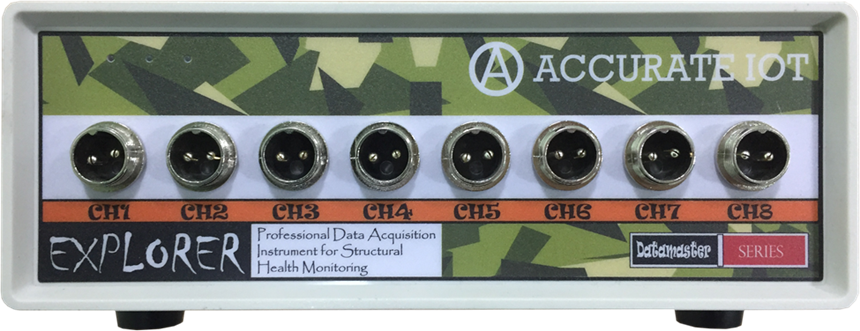
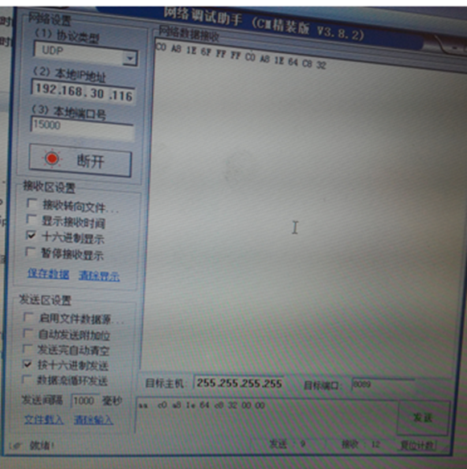

# 电压采集仪（动态采集仪）

## 产品信息

### 功能介绍

EXPLORER 多功能数据采集仪提供 8 个可以测量多种模拟型信号的通道，采用 GX16 两芯航空插座的输入形式，可以对多种传感器进行采集，包括：ICP 压电式加速度传感器(外接 ICP 解调板)、磁电式传感器、风压传感器(外接风压解调板)、倾角仪、应变片(外接应变解调板)、风速风向传感器等。

### 技术指标

- 精 度：24 位
- 采样方式：同步采样
- 采 样 率：100Hz
- 标准量程：-10V ～+10V
- 温度范围：-20 ～+60℃
- 电源电压：DC±15V
- 输 出：100M 网口输出

## 通讯

### UDP

- 本地端口 15000
- 仪器端口 8089

如果要查看仪器的 ip 以及目标 ip ：

指令可以为不包含 0xaa 的任何指令
Eg ：0xff

仪器回复内容中包含仪器的 ip 以及目标主机的 ip、port。

Eg ：
C0 A8 1E 64 ff ff c8 32 00 00

如果要修改目标 ip 以及 port ：
0xaa ip+port

::: info 例如

AA C0 A8 1E 64 C8 32 00 00 （192.168.30.100 13000）
:::

::: info 仪器回复: 包含仪器的 ip 以及目标主机的 ip、port

C0 A8 1E 64 ff ff c8 32 00 00
:::

### TCP

## ToolSoft

## NewExplorer
