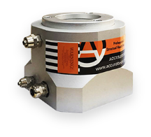
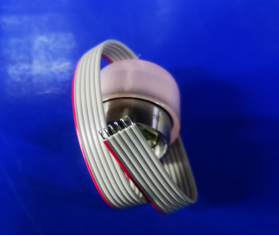
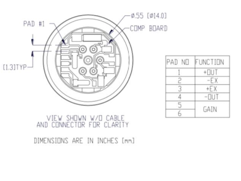
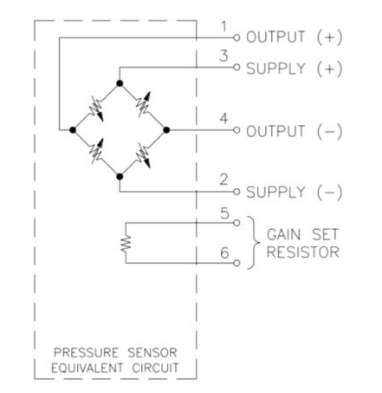
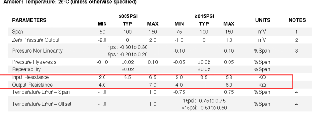
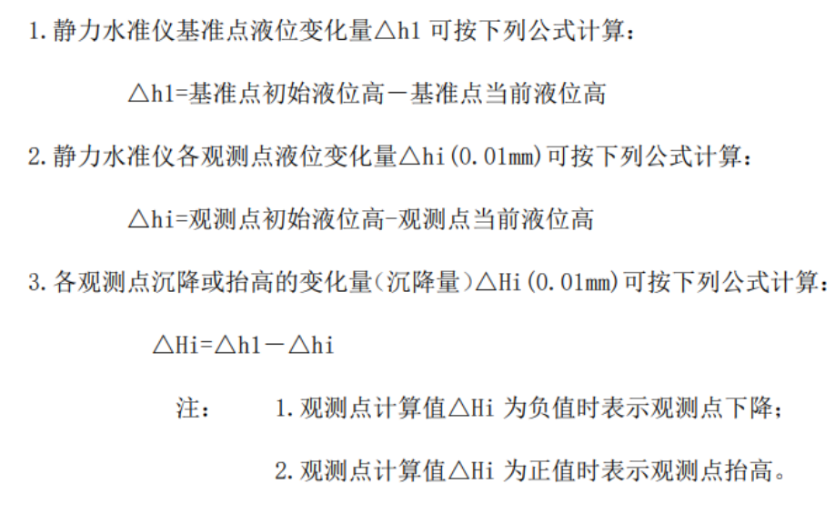
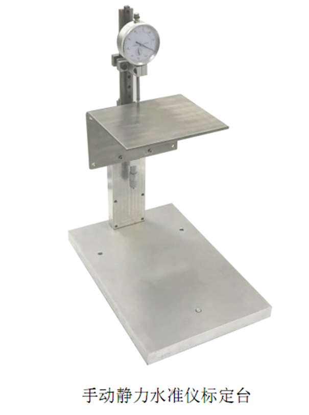

# 电压型水准仪

## 产品信息

### 探头参数

（1）探头实物照片

类型

- 1 G（1m）
- 5 G（5m）

（2）2,3 引脚为输入阻抗；1,4 引脚为输出阻抗；5,6 引脚作为补偿

（3）探头电路原理图 inclinometer

（4）探头阻值技术参数

### 计算公式

## 通信协议

### 读取采集数据格式

PC 发送：64 00 D7 EF 02 00 00 11 00 00 08 00 F8 D3 (先发低位再发高位)

::: info 说明

- 64 00:仪器地址（2 字节）,此处地址为 100 （或者为 00 00 ）注：仪器地址写 00 00 时所有已连接仪器都会回复
- D7 EF:包头 （固定）
- 02 00:命令字
- 00 11 00 00 :内存地址，即 4352
- 08 00 :请求读取的数据内容长度 即表示需要读取 8 个字节
- F8 D3:万能校验码（固定）
  :::

仪器回复：先发低位再发高位，以下为数据:

64 00 1A D7 EF 03 00 00 11 00 00 08 00 +crc1（2 个字节）+位移（4 个字节，单位：mm）+温度（4 个字节，单位：℃）+crc2（2 个字节）

::: info 说明

- 64 00 D7 EF：仪器地址（2 字节）+ D7 EF（固定，2 字节)
- 03 00：命令字(2 字节)
- 00 11 00 00：内存地址：4352（4 字节）
- 08 00：数据长度（8 字节）表示 2 个 float 数据的长度
- crc 校验 1(2 字节) :从命令字开始算起（即 03 开始）
- 数据内容(8 个字节)：
- crc2(2 字节)，从数据内容开始算起
  :::

### 读取斜率补偿系数

PC 发送：00 00 D7 EF 02 00 18 00 00 00 04 00 F8 D3
::: info 说明

- 00 00:仪器地址（2 字节）（或者为 00 00 ）注：仪器地址写 00 00 时所有已连接仪器都会回复
- D7 EF:包头 （固定）
- 02 00:命令字
- 18 00 00 00 :内存地址，即 24
- 04 00 :请求读取的数据内容长度 即表示需要读取 4 个字节
- F8 D3:万能校验码（固定）
  :::

仪器回复：64 00 D7 EF 03 00 18 00 00 00 04 00 CRC1 校验（2 个字节） 53 05 B3 3E +crc2 校验（2 个字节）
::: info 说明

- 64 00 D7 EF：仪器地址（2 字节）+ D7 EF（固定，2 字节)
- 03 00：命令字(2 字节)
- 18 00 00 00：内存地址（此处为 24）
- 04 00：数据长度（2 字节），4
- 01 06：CRC1 校验，从命令字开始算起
- 53 05 B3 3E：数据内容，即斜率补偿系数
- CRC2 校验，从数据内容开始算起
  :::

### 读取零点偏移补偿系数

PC 发送：00 00 D7 EF 02 00 1C 00 00 00 04 00 F8 D3
::: info 说明

- 64 00:仪器地址（2 字节）（或者为 00 00 ）注：仪器地址写 00 00 时所有已连接仪器都会回复
- D7 EF:包头 （固定）
- 02 00:命令字
- 1C 00 00 00 :内存地址，即 28
- 04 00 :请求读取的数据内容长度 即表示需要读取 4 个字节
- F8 D3:万能校验码（固定）
  :::

仪器回复：64 00 D7 EF 03 00 1C 00 00 00 04 00 CRC1 校验（2 个字节） 00 00 00 00 CRC2 校验（2 个字节）
::: info 说明

- 64 00 D7 EF：仪器地址（2 字节）+ D7 EF（固定，2 字节)
- 03 00：命令字(2 字节)
- 1C 00 00 00：内存地址（此处为 28）
- 04 00：数据长度（2 字节），4
- 00 82：CRC1 校验，从命令字开始算起
- 00 00 00 00：数据内容，即零点偏移补偿系数
- 00 24：CRC2 校验，从数据内容开始算起
  :::

## 手动标定台

静力水准系统是测量两点间或多点间相对高度变化的精密仪器。主要用于大型储罐、大坝、核电站、高层建筑、基坑、隧道、桥梁、地铁等垂直位移和倾斜的监测。静力水准系统一般安装在被测物体等高的测墩上或被测物体墙壁等高线上通常采用一体化模块化自动测量单元采集数据，通过有线或无线通讯与计算机相连，从而实现自动化测试。

ACCURATE IOT 各款静力水准仪的通用标定设备。操作简单，使用方便。

安装与连线方式

予埋地板组件包括刚底板和三根不锈钢螺杆。此组件应在建立静力水准测点仪器墩的混凝土中。各仪器墩面高程需用水准仪找平，允许高差 5mm。予埋底板面与仪器墩混凝土面平插入予埋底板组件后用水平尺找平，保持三根定位螺杆与仪器墩面垂直。

如果有些场合不便或不需要建混凝土仪器墩，可以采用角钢制作的悬臂式三角支架与被测点位刚性耦合，悬臂三角支架提供仪器安装平面，各测点所提供的仪器安装平面高差也应该控制在 5mm 的范围内。
