# 电流型水准仪

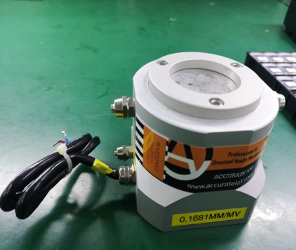

### 接线图

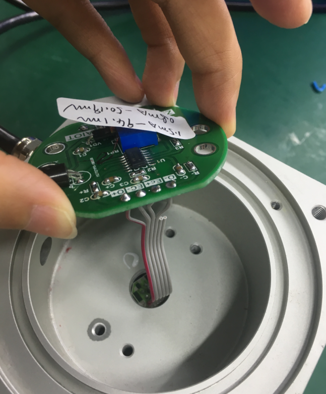

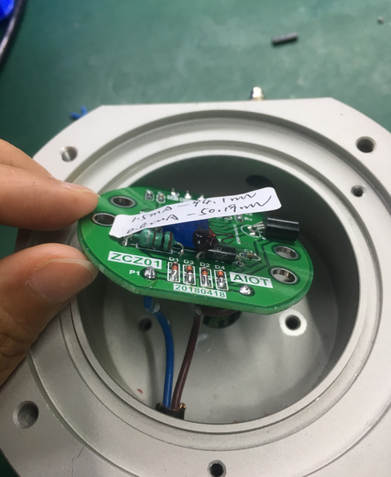

## 产品标定

### 所需工具

1. 搭载测试所需软件电脑一台
2. 网线两根
3. 路由器一台
4. 静态采集模块一台 （康耐得模块）
5. 12V 电源（为康耐得模块供电）
6. DC 12V 485 转网口模块（后续测试统一使用 12V 485 模块）

### 标定内容

1.静态波动 BD 值 2.K 值 3.b 值

### 标定步骤

（1）设备连接

两根网线，一根一端插电脑，另一根一端插 485 转网口模块，另外两端插路由器

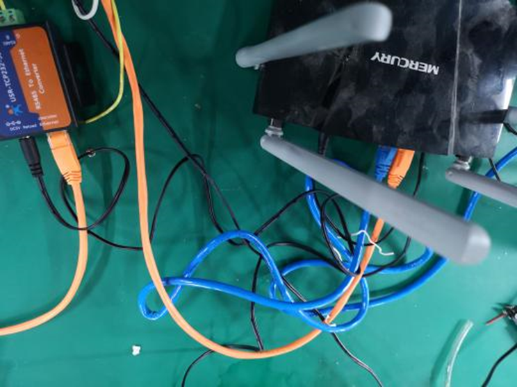

12V 电压源接入静态采集模块的 12V 供电接口，再通过三芯接口接入 485 转网口模块

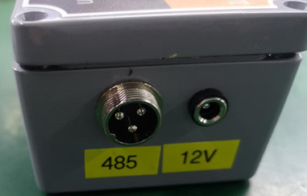

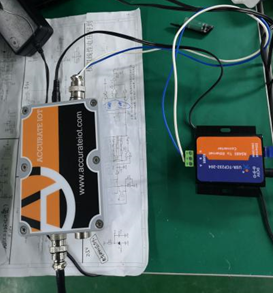

将静力水准仪接入静态采集模块的 A1 或 A2 端口

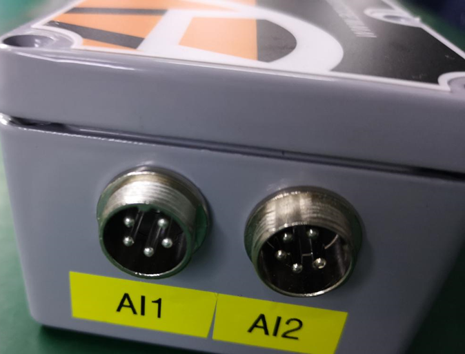

（2）网络配置

检查电脑 IP，网络 → 网络和共享中心 → 更改适配器设置（192.168.30.100）

（3）软件配置

打开“小绿人”点击“搜索设备”检查确定目标 IP 是否与电脑 IP 一致，访问端口为 13000，注意模块静态 IP 的末位，这里为 9，这个末位即为测试软件中的仪器 IP 末位

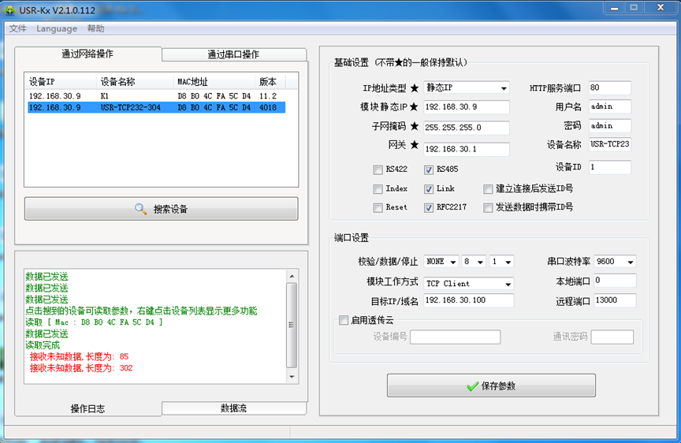

（4）开始标定

打开测试软件

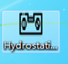

点击“参数配置”，工程名称中输入 1，工程描述中输入 1，文件存储路径选择桌面即可，点击“保存”

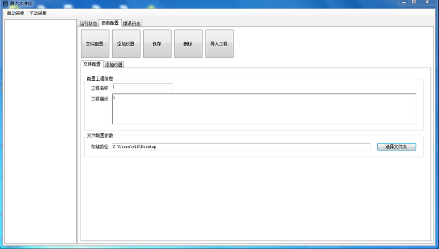

选择“添加仪器”，485 地址填写静态采集模块外壳上标注的地址，访问端口 13000，通讯方式固定 IP，仪器 IP 末位填写刚才模块静态 IP 的末位 9，时间单位选择秒，点击“保存”

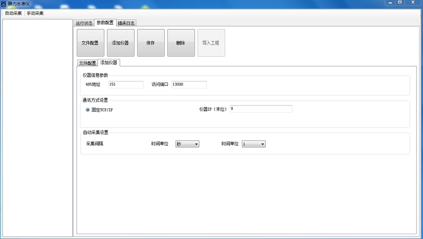

在测试软件左侧界面打开已添加的仪器，点击“自动采集”进行监控对应通道电压变化，电压单位：uA

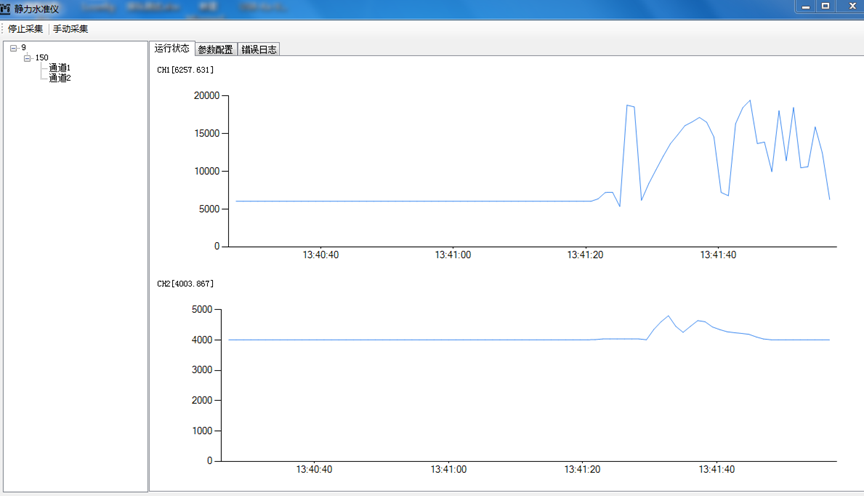

记录初始电压，正常值在 4000uA，在水准仪不灌入液体的情况下，观察其电压波动

先水准仪灌满液体（注意气泡）放在图一的位置，高度为 H1，读出一个电压值 V1；再将水准仪放置在图二的位置，高度为 H2，读出一个电压值 V2

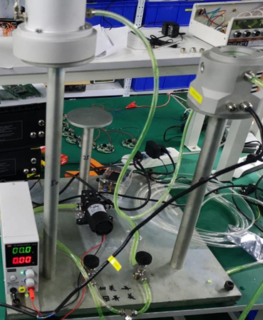

（5）参数计算

两平台固定高度差为 150mm，计算 K 值，K=150/V2-V1，单位为 mm/uA

计算 b 值，b=BD\*K
