# 地震仪

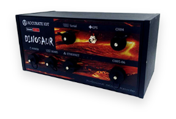

## 安装说明

### 连接线

#### SMA 公头转 BNC 公头

将 50cm 长 SMA 公头转 SMA 公头连接线从中间剪断并拨线，线头镀锡；再按照下图将线头焊接在 BNC 公头上并套好热缩管。

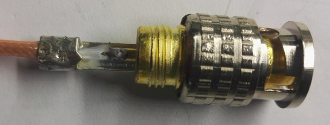

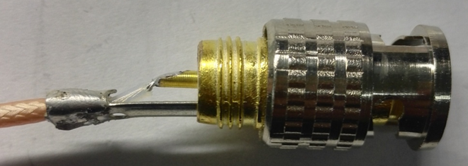

成品图如下

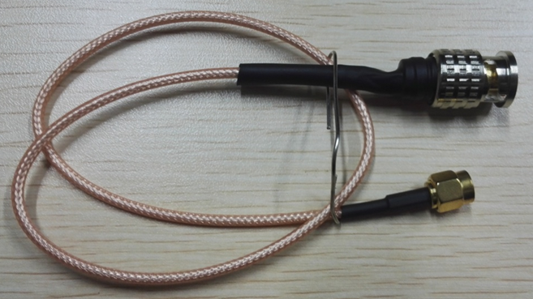

#### 内部电源线制作

取三根 20cm 长不同颜色的电线（不宜过粗或过细，适宜即可），按照下图所示，4 芯 5.08 插头卡扣朝上，从上到下依次焊接到威浦航空插座（WS24-4）的对应 1、2、3 脚上（1 脚为电源+15V、2 脚为 GND、3 脚为电源-15V），并套接热缩管。

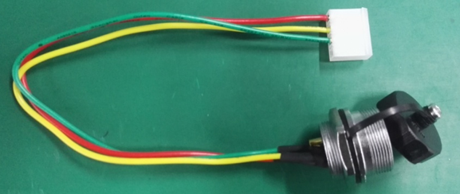

#### 内部网线制作

取网线 30cm，按照标准压接在水晶头上（可参考成品网线接线顺序，即从左到右橙白色、橙色、绿白色、蓝色、蓝白色、绿色、咖白色，咖色）；除去网线外层蓝色保护层，套好热缩管，按顺序依次焊接在威浦航空插座（WS28-10）的 1~8 脚，如下图所示

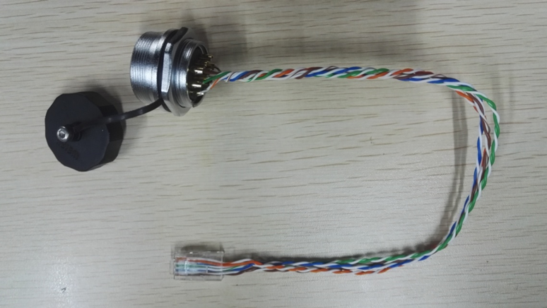

#### 外部网线制作

取 1.5m 长成品网线一个，剪去一头按照橙白色、橙色、绿白色、蓝色、蓝白色、绿色、咖白色，咖色的顺序套好热缩管依次焊接在威浦航空插头（WS28-10）的 1~8 脚，如下图所示。

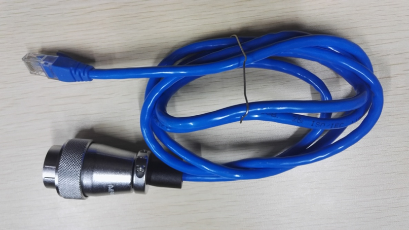

#### 外部电源制作

取电压采集仪 ±15V 电源一个，除去输出端 3 芯航空插头，按照红色、绿色、蓝色的顺序套好热缩管依次焊接在威浦航空插头（WS24-4）的 1、2、3 脚，如下图所示。

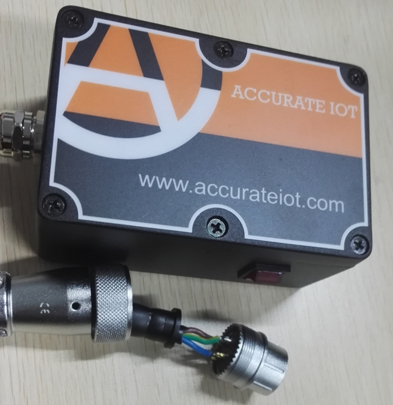

### 安装步骤

#### 安装工具

- 1. 地震仪配件单物料一份
- 2. 剥线钳一把
- 3.十字螺丝刀一把
- 4. 电烙铁一个
- 5.扳手一个
- 6. 全透明环氧胶 5min 和 Kafuter 卡夫特 K-200 工业胶粘剂、502 胶水

#### 安装地震仪外壳

贴纸：将完好的贴纸准确无误地对准打孔的位置贴在地震仪机壳上。

装小灯管:将测试完好的 2.54 圆形 LED 红绿灯按下图方式插入到对应的孔里面

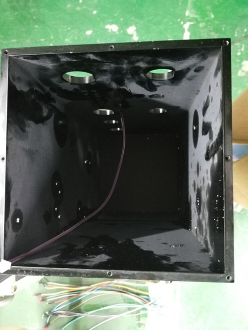

颜色区分按下图方式插接

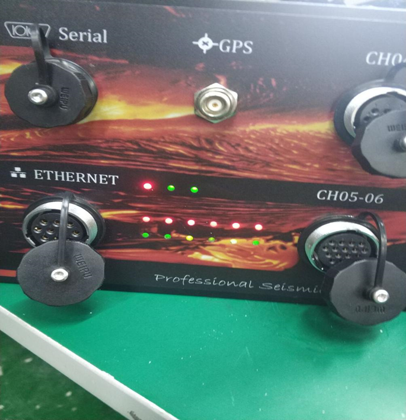

再用 502 胶水进行初次固定，等胶干后，打上全透明环氧胶,等上 5min 胶干即可

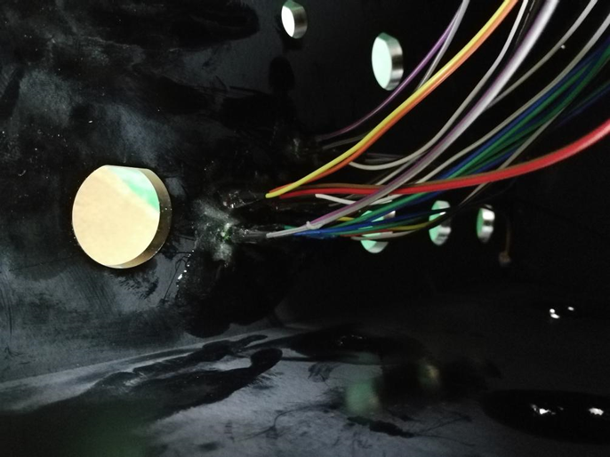

排列方式第一排从左至右三个：红+绿+绿；第二排 6 个全红；第三排 6 个全绿。(红色共 7 个，绿色共 8 个）

#### 安装插头和插座

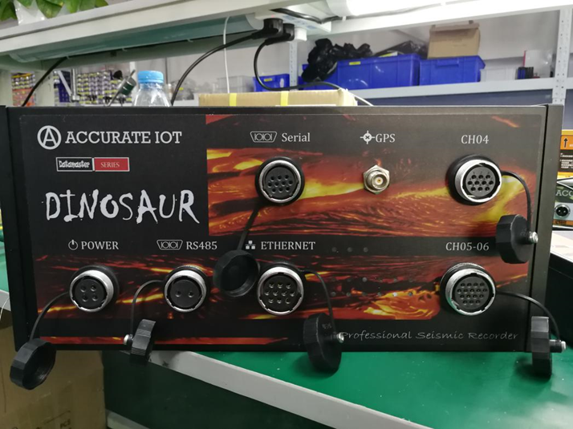

（1）将航空插头 WS24-4 芯（ZM）所对应的插座安装在 POWER 位置，插座正向放入圆孔内（圆孔上方平角部分对准），再用六边形螺母从地震仪机壳后面将插座固定，内部电源线则由 4 芯 5.08 插头尾线线长 20cm 构成。（见图 1-4）

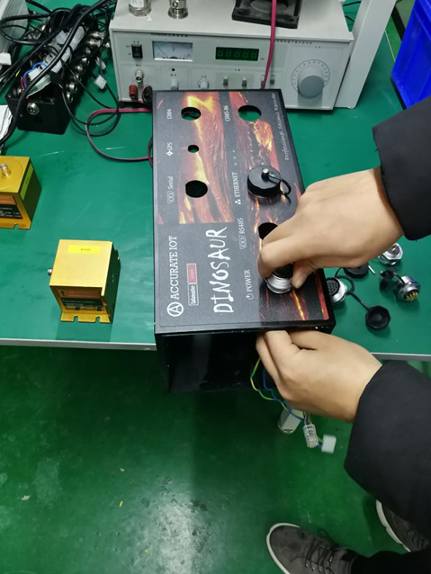

（2）将航空插头 WS24-2 芯（ZM）圆形插座放入 RS485 孔，悬空无作用，后期若需要可再接。（见图 1-5）

（3）将航空插头 WS28-10 芯（ZM）所对应的插座放入 ETHERNET 位置，插座正向放入圆孔内（圆孔上方平角部分对准），再用六边形螺母从地震仪机壳后面将插座固定，内部网线由水晶头压接 30cm 网线连接至威普网口输出插座。（见图 1-4）

（4）将航空插头 WS24-10 芯（ZM）圆形插座放入 Serial 孔，悬空无作用，后期若需要可再接。（见图 1-5）

（5）将航空插头 WS24-10 芯（ZM）圆形插座放入 CH04 孔，悬空无作用，后期若需要可再接。（见图 1-5）

（6）将航空插头 WS28-16 芯（ZM）圆形插座放入 CH05-06 孔，悬空无作用，后期若需要可再接。（见图 1-5）

（7）将 GPS 插座：TNC-C-KY3 TNC 母头插入 GPS 孔内，用六边形螺母从地震仪机壳后面将母头固定，再用布料遮住母头，轻轻用扳手固定住。（见图 1-5）

#### 安装磁电式加速度传感器

首先测试加速度传感器是否完好：±15V 电压采集仪电源和成品网线（1.5 米）分别接入地震仪主板（已下载地震仪程序），网线另一端接入电脑，先将一台竖直磁电式加速度传感器接入电路板信号输出端第一通道（测试用，选用第一通道）

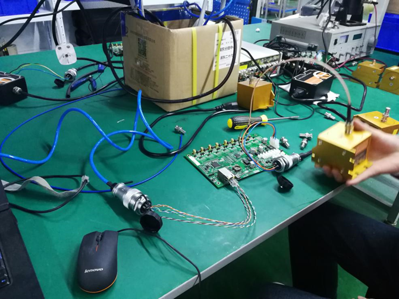

打开 AITO - ExplorerV2.0.2 版本，自动跳出监控端口和仪器编码，此时仪器编码是 10168，缓慢上下晃动竖直磁电式加速度传感器可以看到出现一个均匀的正弦式波形，水平摇摆没有反应，说明该竖直磁电式加速度传感器是完好的。

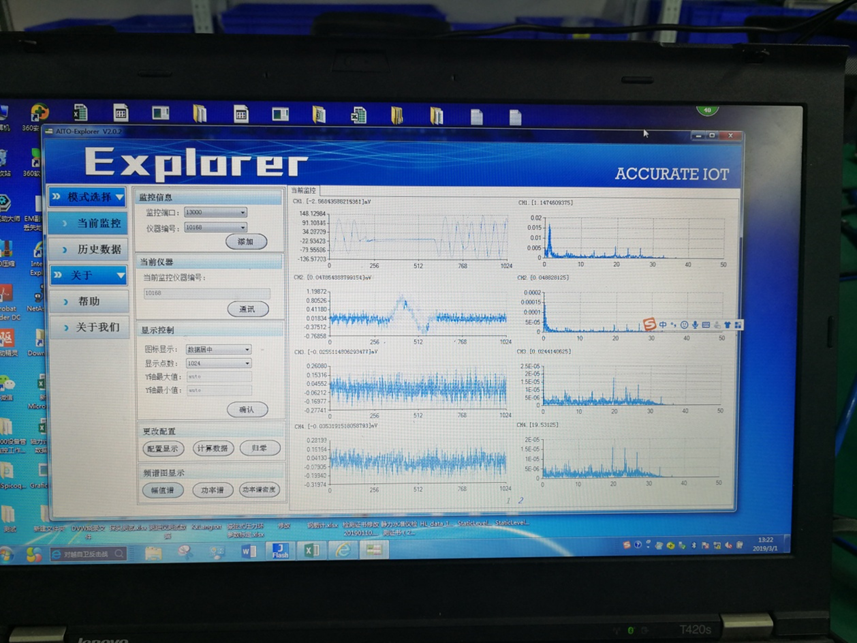

同理，测试另外两个水平磁电式加速度传感器。

安装磁电式加速度传感器：2 个水平磁电式加速度传感器和 1 个竖直磁电式加速度传感器分别代表三个轴：X\Y\Z，首先由于工装的实际情况，先将 Y 轴方向上的水平磁电式加速度传感器固定在中间，螺丝采用 M3*200 内六角黑色，螺母用 M3 螺母，垫片使用规格型号为 M3*9\*0.8 垫片。固定完后，用全透明环氧胶封住，等 5min 胶水干。

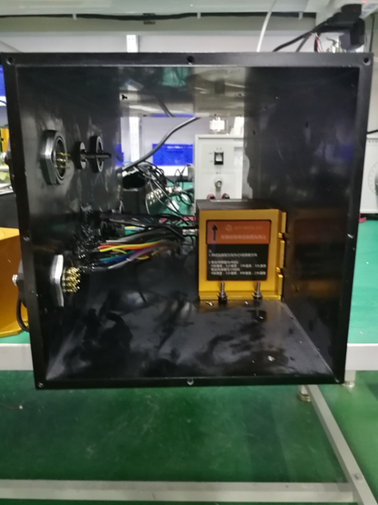

同理，使用相同规格的螺丝螺母和垫片安装 X 轴（水平磁电式加速度传感器）和 Z 轴（竖直磁电式加速度传感器），固定完后，用全透明环氧胶封住，等 5min 胶水干。

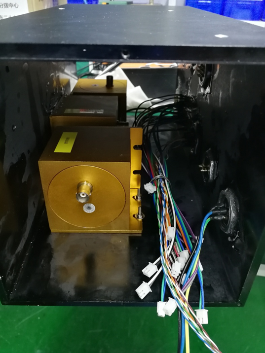

安装完后，将 SMA 公头转 BNC 公头连接线分别接入地震仪主板的第一第二第三通道和 X、Y、Z 三个加速度传感器，并固定。

#### 安装地震仪主板

将灯泡末端的排针插入地震仪主板上相对应的排针插座内，航空插头 WS28-10 芯（ZM）插座内部网线接入地震仪主板网口端口底座，航空插头 WS24-4 芯（ZM）内部电源线接入地震仪主板上电源排针底座上（见图 2-1），再用 Kafuter 卡夫特 K-200 工业胶粘剂将所有点进行封胶，静置 5 分钟，等胶风干。

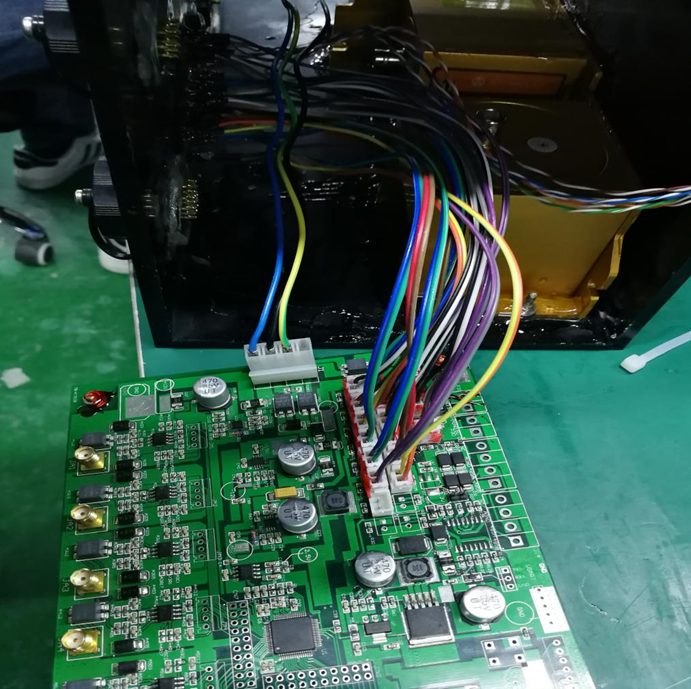

胶水固定住后，将主板反面贴到地震仪外壳螺孔处，四角上放置规格为 M3*10 双通铜柱 4 个，对准外壳孔后，用 M3*10 内六角黑色螺丝灌 Kafuter 卡夫特 K-200 工业胶粘剂拧紧。

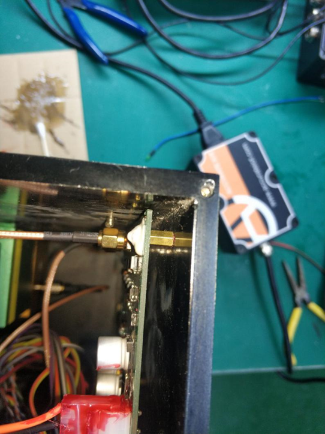

安装完毕，另一侧用 M4\*6 沉头螺丝加全透明环氧胶固封。

剩下两侧板子先用密封条放入板子内部凹槽（见图 3-4），打上 Kafuter 卡夫特 K-200 工业胶粘剂，再用用平头螺丝 M3\*12 固定拧紧

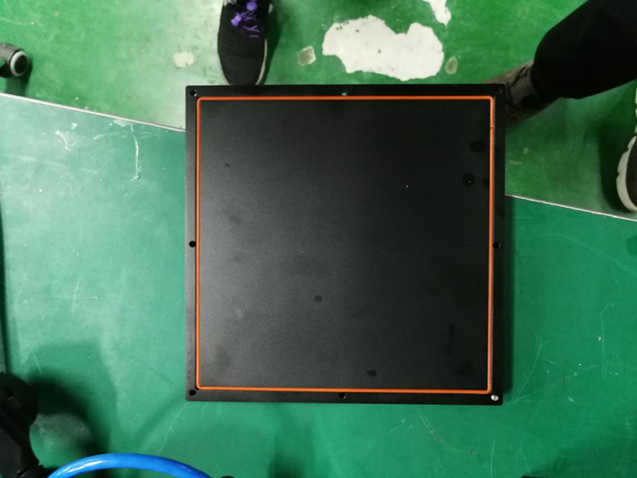

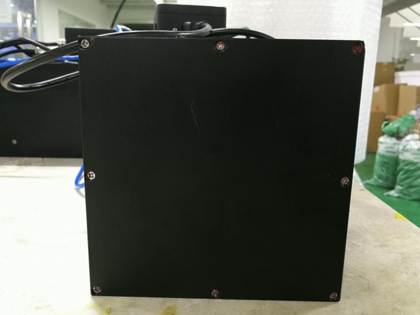

## 测试地震仪

### 连接

将地震仪外部 POWER 航空插头 WS24-4 芯（TQ）插头和外部 ETHERNET 航空插头 WS28-10 芯（TQ）插头分别接入地震仪。WS24-4 芯（TQ）插头与 ±15V 电源相接，为地震仪供电，WS28-10 芯（TQ）插头连接网线，与测试电脑相联通。打开电源，地震仪进入初始状态，全部灯都变亮。

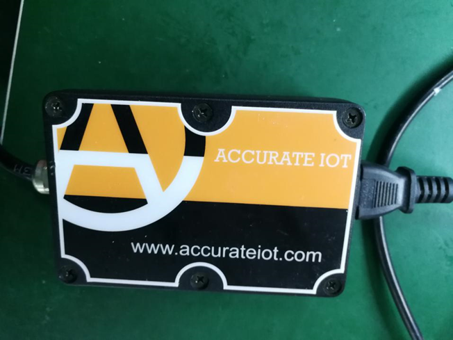

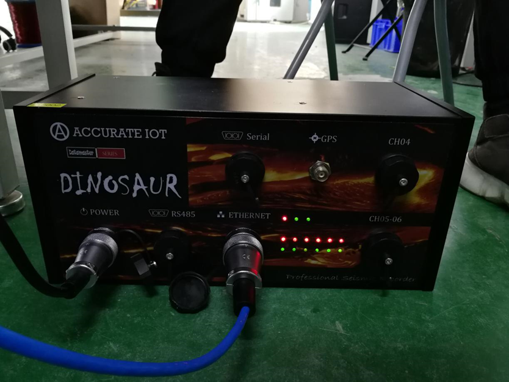

### 测试

打开 AITO - ExplorerV2.0.2 版本,自动打开监控端口和仪器编号，将图标显示为数据居中，显示点数为 1024。等待电压基本维持在 0 附近，则处于初始稳定状态。

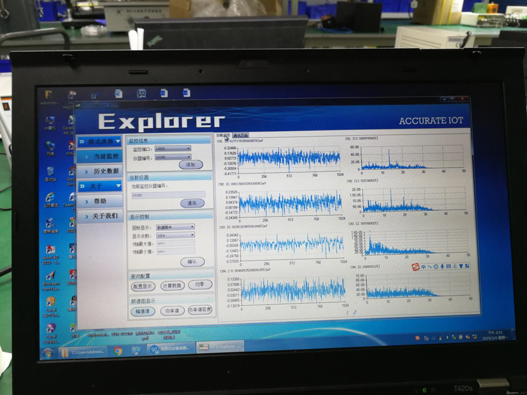

根据 X\Y\Z 三通道磁电式加速度传感器安装位置，EXPLORER 软件第一通道显示 X 轴的水平运动波形（见图 4-4），第二通道显示 Y 轴的水平运动波形（见图 4-5），第三通道显示 Z 轴的竖直运动波形（见图 4-6）（因人为操作，波形会产生微小误差）。

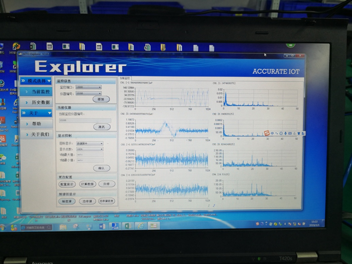

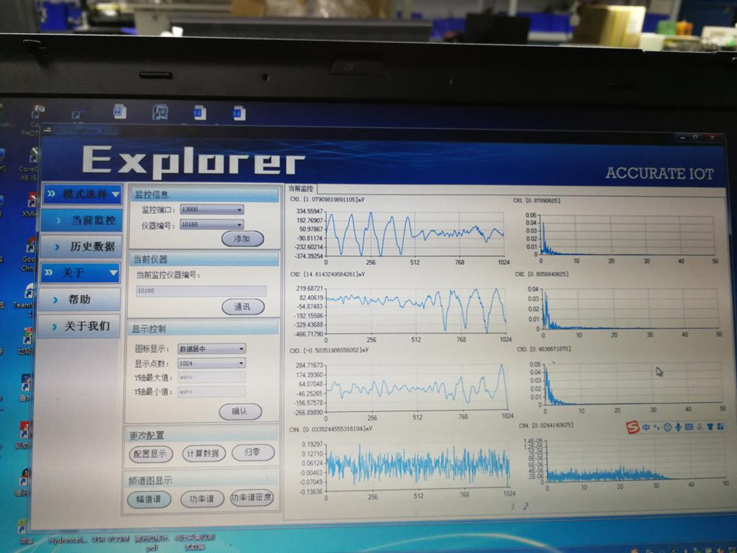

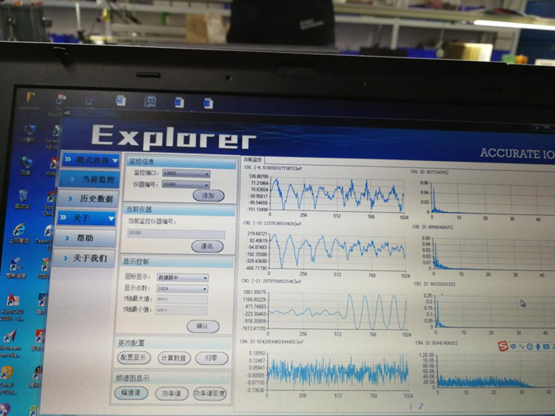

三通道测试完后，静置等波形稳定，打开通讯端口，写入 740 1 静置一分钟，待波形稳定在 0 附近（见图 4-7）。再写入 4 15002（更改仪器编码为 15002） 等待一分钟。

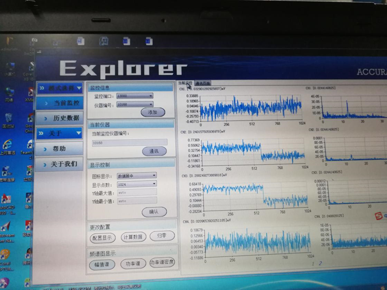

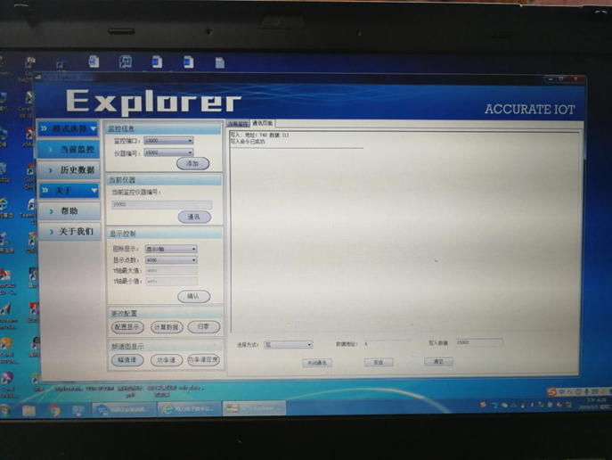

在归零状态时，机壳外壳所有的灯都会闪亮，待只剩下上面三盏灯亮，其余都灭的时候，归零结束（见图 4-8）。

最后，检查仪器外壳是否密封完整并擦拭干净，配上 ±15V 电源线插头和网线插头一起出货。
